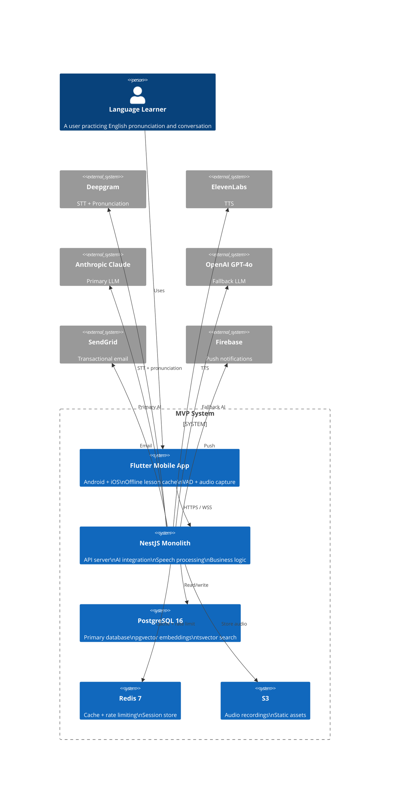
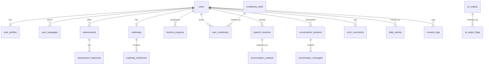

# MVP Architecture V2 — Implementation Baseline

**Version:** 2.0  
**Date:** 2026-05-31  
**Status:** Implementation Baseline  
**Predecessor:** `mvp-architecture.md` (V1, superseded)

---

## Table of Contents

1. Architecture Diagram
2. Service Boundaries
3. Database Schema
4. REST API Design
5. AI Architecture
6. Speech Architecture
7. Security Architecture
8. Risk Register
9. Cost Model
10. Final Recommendation

---

## 1. Architecture Diagram

### 1.1 System Context



### 1.2 Container Diagram

```
┌───────────────────────────────────────────────────────────────────────┐
│                        Flutter Mobile App                              │
│                                                                         │
│  ┌──────────────────┐  ┌──────────────────┐  ┌──────────────────┐    │
│  │  Onboarding UI    │  │  Lesson UI       │  │  Conversation UI │    │
│  │  - Register       │  │  - Exercises     │  │  - Voice chat    │    │
│  │  - Placement      │  │  - Speaking      │  │  - Corrections   │    │
│  │  - Consent flow   │  │  - Vocab review  │  │  - Transcript    │    │
│  └──────────────────┘  └──────────────────┘  └──────────────────┘    │
│                                                                         │
│  ┌────────────────────────────────────────────────────────────────┐    │
│  │  Offline Layer                                                  │    │
│  │  • Cache today's lesson (IndexedDB)                             │    │
│  │  • Cache 5 vocab items for review                               │    │
│  │  • Queue completed exercises for sync                           │    │
│  │  • Retry failed uploads with exponential backoff                │    │
│  └────────────────────────────────────────────────────────────────┘    │
│                                                                         │
│  ┌──────────────────┐  ┌──────────────────┐  ┌──────────────────┐    │
│  │  VAD (WebRTC)    │  │  Opus encode      │  │  Audio player    │    │
│  │  Voice activity  │  │  (server-side)    │  │  + TTS playback  │    │
│  │  detection       │  │  Raw WAV upload  │  │                  │    │
│  └──────────────────┘  └──────────────────┘  └──────────────────┘    │
└─────────────────────────────┬─────────────────────────────────────────┘
                              │ HTTPS / WSS (auto-reconnect)
                              ▼
┌───────────────────────────────────────────────────────────────────────┐
│                    NestJS Monolith (Railway/Render)                     │
│                                                                         │
│  ┌────────────────────┐  ┌────────────────────┐  ┌────────────────┐   │
│  │  AuthModule        │  │  AssessmentModule  │  │  LearningModule│   │
│  │  • Register/login  │  │  • Placement test  │  │  • Lesson gen  │   │
│  │  • JWT + refresh   │  │  • Daily quiz     │  │  • Exercise     │   │
│  │  • OAuth (Google)  │  │  • Weekly assess  │  │  • Scoring      │   │
│  └────────┬───────────┘  └────────┬───────────┘  └────────┬───────┘   │
│           │                       │                       │            │
│  ┌────────▼───────────┐  ┌────────▼───────────┐  ┌────────▼───────┐   │
│  │  ConversationModule│  │  VocabularyModule  │  │  ProgressModule│   │
│  │  • WS session      │  │  • SM-5 algorithm  │  │  • Dashboard   │   │
│  │  • AI turns        │  │  • Due queue       │  │  • Streaks     │   │
│  │  • Corrections     │  │  • Search bank     │  │  • Analytics   │   │
│  └────────┬───────────┘  └────────┬───────────┘  └────────┬───────┘   │
│           │                       │                       │            │
│  ┌────────▼───────────────────────▼───────────────────────▼───────┐   │
│  │                     AIGateway Module                             │   │
│  │                                                                  │   │
│  │  ┌────────────────┐  ┌────────────────┐  ┌────────────────┐    │   │
│  │  │  ModelRouter   │  │  PromptManager │  │  ContentValid. │    │   │
│  │  │  • if-else     │  │  • Templates   │  │  • Zod schema  │    │   │
│  │  │  • Fallback    │  │  • Versioned   │  │  • Safety      │    │   │
│  │  │  • CircuitBrkr │  │  • Git-tracked │  │  • Confidence  │    │   │
│  │  └────────────────┘  └────────────────┘  └────────────────┘    │   │
│  │                                                                  │   │
│  │  ┌────────────────┐  ┌────────────────┐  ┌────────────────┐    │   │
│  │  │  CostGuard     │  │  ResponseCache │  │  RetryHandler  │    │   │
│  │  │  • Per-user    │  │  • Redis       │  │  • Exponential │    │   │
│  │  │  • Monthly cap │  │  • 15-20% hit │  │  • Max 3 tries │    │   │
│  │  │  • Anomaly     │  │  • TTL per type│  │  • Jitter      │    │   │
│  │  └────────────────┘  └────────────────┘  └────────────────┘    │   │
│  └──────────────────────────────────────────────────────────────────┘   │
│                                                                         │
│  ┌──────────────────────────────────────────────────────────────────┐   │
│  │  SpeechModule                                                     │   │
│  │  • Deepgram STT client                                           │   │
│  │  • Deepgram pronunciation scoring                                │   │
│  │  • ElevenLabs TTS client                                         │   │
│  │  • Audio preprocessing (noise gate, normalization, HPF)          │   │
│  │  • S3 upload + signed URL generation                             │   │
│  └──────────────────────────────────────────────────────────────────┘   │
│                                                                         │
│  ┌──────────────────────────────────────────────────────────────────┐   │
│  │  Shared Infrastructure                                            │   │
│  │  • Request tracing (correlation IDs)                              │   │
│  │  • Structured logging (JSON)                                      │   │
│  │  • Rate limiting (in-process)                                     │   │
│  │  • EventEmitter (internal events)                                 │   │
│  │  • Health checks + readiness probes                              │   │
│  └──────────────────────────────────────────────────────────────────┘   │
└─────────────────────────────┬───────────────────────────────────────────┘
                              │
        ┌─────────────────────┼─────────────────────┐
        │                     │                     │
        ▼                     ▼                     ▼
┌───────────────┐   ┌───────────────┐   ┌──────────────────────┐
│ PostgreSQL 16 │   │   Redis 7     │   │   S3                 │
│               │   │               │   │                      │
│ • 1 writer    │   │ • Cache       │   │ • User audio         │
│ • 7-day PITR  │   │ • Rate limits │   │ • TTS cache          │
│ • Daily dump  │   │ • Sessions    │   │ • Lifecycle: 30d    │
│ • Staging DB  │   │               │   │   → IA, 90d → delete │
└───────────────┘   └───────────────┘   └──────────────────────┘
```

### 1.3 Deployment Architecture

```
┌──────────────────────────────────────┐
│          Railway / Render             │
│                                      │
│  ┌────────────────────────────────┐  │
│  │  NestJS Monolith (2 replicas)   │  │
│  │  • $0.013/hr each              │  │
│  │  • Auto-scaling: 1-4 replicas  │  │
│  │  • Zero-downtime deploys       │  │
│  │  • Built-in HTTPS + logging    │  │
│  └────────────────────────────────┘  │
│                                      │
│  ┌────────────────────────────────┐  │
│  │  PostgreSQL 16 (managed)       │  │
│  │  • 1 GB RAM, 10 GB storage    │  │
│  │  • Automated backups          │  │
│  │  • Point-in-time recovery     │  │
│  │  • $15-20/mo                  │  │
│  └────────────────────────────────┘  │
│                                      │
│  ┌────────────────────────────────┐  │
│  │  Redis 7 (managed)             │  │
│  │  • 256 MB                      │  │
│  │  • $5-10/mo                   │  │
│  └────────────────────────────────┘  │
│                                      │
│  ┌────────────────────────────────┐  │
│  │  Staging Environment           │  │
│  │  • Same stack, 1 replica      │  │
│  │  • Smaller DB (512 MB)        │  │
│  │  • ~$25-35/mo                 │  │
│  └────────────────────────────────┘  │
└──────────────────────────────────────┘
```

**Why Railway/Render over ECS Fargate:**
- Zero DevOps: no task definitions, IAM roles, or ALB config
- Built-in logging with search (no CloudWatch setup)
- Automatic HTTPS + custom domains
- Preview deployments per PR branch
- $50-80/mo vs. $180/mo for equivalent Fargate setup
- Migration path: export Dockerfile, deploy anywhere, anytime

---

## 2. Service Boundaries

### 2.1 Module Map (Within NestJS Monolith)

| Module | Responsibility | Key Files | External Dependencies |
|--------|---------------|-----------|----------------------|
| `AuthModule` | Registration, login, token management, OAuth | `auth.controller.ts`, `auth.service.ts`, `jwt.strategy.ts` | SendGrid (welcome email) |
| `UserModule` | Profile CRUD, preferences, consent management | `user.controller.ts`, `user.service.ts` | S3 (avatar) |
| `AssessmentModule` | Placement test, daily quiz, weekly assessment | `assessment.controller.ts`, `placement.service.ts` | AIGateway (generate questions, score responses) |
| `LearningModule` | Daily lesson generation, exercise management, scoring | `lesson.controller.ts`, `lesson.service.ts` | AIGateway (generate lesson), SpeechModule (score speaking) |
| `ConversationModule` | WebSocket session, AI conversation turns, corrections | `conversation.gateway.ts`, `conversation.service.ts` | AIGateway (generate response + correction) |
| `VocabularyModule` | Vocab bank search, SM-5 algorithm, review queue | `vocabulary.controller.ts`, `sm5.service.ts` | None (self-contained algorithm) |
| `ProgressModule` | Dashboard, daily activity, streaks, skill tracking | `progress.controller.ts`, `progress.service.ts` | None |
| `AIGatewayModule` | LLM routing, prompt management, content validation, cost control | `model-router.ts`, `prompts/`, `content-validator.ts`, `cost-guard.ts` | Anthropic Claude (primary), OpenAI GPT-4o (fallback) |
| `SpeechModule` | STT, pronunciation scoring, TTS, audio preprocessing, S3 storage | `stt.service.ts`, `pronunciation.service.ts`, `tts.service.ts` | Deepgram, ElevenLabs, S3 |
| `AdminModule` | Basic user lookup, content flag review, system health | `admin.controller.ts` | None |

### 2.2 EventEmitter Events (Internal, No Redis Pub/Sub)

```typescript
// No Redis pub/sub. These are in-process events.
// Handlers are registered in the same process.
// If you extract services later, migrate these to Redis.

enum InternalEvent {
  LESSON_COMPLETED = 'lesson.completed',
  CONVERSATION_ENDED = 'conversation.ended',
  VOCAB_REVIEW_DUE = 'vocab.review.due',
  STREAK_UPDATED = 'streak.updated',
  USER_INACTIVE_3D = 'user.inactive.3d',
  COST_THRESHOLD_HIT = 'cost.threshold.hit',
  AI_OUTPUT_FLAGGED = 'ai.output.flagged',
}
```

### 2.3 Offline Sync Protocol

```
Client → Server (on reconnect):
  POST /v1/sync/lessons
    Body: { completed_exercises: [{ lessonId, exerciseId, response, timestamp }] }
    Response: { synced: number, failed: number, feedback: [...] }

Server → Client (on lesson fetch):
  Response includes: { lesson, expiresAt, offlineTtl }
  Client caches lesson in IndexedDB until expiresAt.
  If offline during exercise, queue results; sync on reconnect.
```

---

## 3. Database Schema

### 3.1 Entity Relationship Diagram



### 3.2 Table Definitions

#### users
```sql
CREATE TABLE users (
    id              UUID PRIMARY KEY DEFAULT gen_random_uuid(),
    email           VARCHAR(255) UNIQUE NOT NULL,
    password_hash   VARCHAR(255),
    auth_provider   VARCHAR(20) DEFAULT 'email',  -- 'email', 'google'
    auth_provider_id VARCHAR(255),
    tier            VARCHAR(20) DEFAULT 'free',     -- 'free', 'premium' (MVP: all free)
    is_active       BOOLEAN DEFAULT true,
    consent_granted BOOLEAN DEFAULT false,           -- voice recording consent
    consent_granted_at TIMESTAMPTZ,
    created_at      TIMESTAMPTZ DEFAULT NOW(),
    updated_at      TIMESTAMPTZ DEFAULT NOW()
);
CREATE INDEX idx_users_email ON users(email) WHERE is_active = true;
```

#### user_profiles
```sql
CREATE TABLE user_profiles (
    id                UUID PRIMARY KEY DEFAULT gen_random_uuid(),
    user_id           UUID UNIQUE REFERENCES users(id),
    name              VARCHAR(255) NOT NULL,
    age               INTEGER CHECK(age >= 5 AND age <= 120),
    country_code      VARCHAR(3) NOT NULL,
    native_language   VARCHAR(10) NOT NULL,
    learning_goal     VARCHAR(50) NOT NULL,  -- 'travel', 'career', 'exams', 'migration', 'general'
    daily_study_min   INTEGER CHECK(daily_study_min >= 5 AND daily_study_min <= 180),
    learning_style    VARCHAR(20) DEFAULT 'mixed',  -- 'visual', 'auditory', 'reading', 'mixed'
    teacher_mode      VARCHAR(20) DEFAULT 'friendly',  -- 'friendly', 'professional'
    onboarding_complete BOOLEAN DEFAULT false,
    created_at        TIMESTAMPTZ DEFAULT NOW(),
    updated_at        TIMESTAMPTZ DEFAULT NOW()
);
```

#### user_languages
```sql
CREATE TABLE user_languages (
    id              UUID PRIMARY KEY DEFAULT gen_random_uuid(),
    user_id         UUID REFERENCES users(id),
    language_code   VARCHAR(10) NOT NULL,  -- 'en' only for MVP
    goal_cefr       VARCHAR(3) NOT NULL,
    is_primary      BOOLEAN DEFAULT true,
    UNIQUE(user_id, language_code)
);
```

#### assessments
```sql
CREATE TABLE assessments (
    id              UUID PRIMARY KEY DEFAULT gen_random_uuid(),
    user_id         UUID REFERENCES users(id),
    language_code   VARCHAR(10) NOT NULL,
    type            VARCHAR(20) NOT NULL,  -- 'placement', 'daily_quiz', 'weekly'
    status          VARCHAR(20) DEFAULT 'in_progress',
    overall_score   DECIMAL(5,2),
    overall_cefr    VARCHAR(3),
    started_at      TIMESTAMPTZ DEFAULT NOW(),
    completed_at    TIMESTAMPTZ,
    duration_sec    INTEGER
);
CREATE INDEX idx_assessments_user ON assessments(user_id, created_at DESC);
```

#### assessment_responses
```sql
CREATE TABLE assessment_responses (
    id                  UUID PRIMARY KEY DEFAULT gen_random_uuid(),
    assessment_id       UUID REFERENCES assessments(id),
    section_type        VARCHAR(20) NOT NULL,  -- 'listening', 'speaking', 'reading', 'writing', 'vocab', 'grammar'
    question_type       VARCHAR(20) NOT NULL,  -- 'mcq', 'speaking', 'fill_blank'
    content             JSONB NOT NULL,
    user_response       JSONB,
    is_correct          BOOLEAN,
    score               DECIMAL(5,2),
    ai_feedback         TEXT,
    audio_url           TEXT,
    response_time_ms    INTEGER,
    difficulty          INTEGER DEFAULT 1,
    created_at          TIMESTAMPTZ DEFAULT NOW()
);
CREATE INDEX idx_assessment_responses_assessment ON assessment_responses(assessment_id);
```

#### roadmaps
```sql
CREATE TABLE roadmaps (
    id                UUID PRIMARY KEY DEFAULT gen_random_uuid(),
    user_id           UUID REFERENCES users(id),
    language_code     VARCHAR(10) NOT NULL,
    duration_months   INTEGER CHECK(duration_months IN (3, 6, 12)),
    start_date        DATE NOT NULL,
    end_date          DATE NOT NULL,
    current_cefr      VARCHAR(3) NOT NULL,
    target_cefr       VARCHAR(3) NOT NULL,
    is_active         BOOLEAN DEFAULT true,
    generated_at      TIMESTAMPTZ DEFAULT NOW()
);
CREATE INDEX idx_roadmaps_user ON roadmaps(user_id, language_code);
```

#### roadmap_milestones
```sql
CREATE TABLE roadmap_milestones (
    id              UUID PRIMARY KEY DEFAULT gen_random_uuid(),
    roadmap_id      UUID REFERENCES roadmaps(id),
    month_number    INTEGER NOT NULL,
    title           VARCHAR(255) NOT NULL,
    description     TEXT,
    is_completed    BOOLEAN DEFAULT false,
    completed_at    TIMESTAMPTZ,
    sort_order      INTEGER NOT NULL
);
CREATE INDEX idx_roadmap_milestones_roadmap ON roadmap_milestones(roadmap_id);
```

#### lessons_progress
```sql
CREATE TABLE lessons_progress (
    id                  UUID PRIMARY KEY DEFAULT gen_random_uuid(),
    user_id             UUID REFERENCES users(id),
    lesson_date         DATE NOT NULL DEFAULT CURRENT_DATE,
    title               VARCHAR(255) NOT NULL,
    cefr_level          VARCHAR(3) NOT NULL,
    status              VARCHAR(20) DEFAULT 'in_progress',  -- 'assigned', 'in_progress', 'completed'
    score               DECIMAL(5,2),
    time_spent_sec      INTEGER DEFAULT 0,
    exercises_total     INTEGER DEFAULT 0,
    exercises_completed INTEGER DEFAULT 0,
    content             JSONB,  -- AI-generated lesson snapshot
    weak_areas          TEXT[] DEFAULT '{}',
    vocabulary_learned  TEXT[] DEFAULT '{}',
    started_at          TIMESTAMPTZ,
    completed_at        TIMESTAMPTZ,
    created_at          TIMESTAMPTZ DEFAULT NOW(),
    updated_at          TIMESTAMPTZ DEFAULT NOW(),
    UNIQUE(user_id, lesson_date)
);
CREATE INDEX idx_lessons_progress_user ON lessons_progress(user_id, lesson_date DESC);
```

#### vocabulary_bank
```sql
CREATE TABLE vocabulary_bank (
    id              UUID PRIMARY KEY DEFAULT gen_random_uuid(),
    language_code   VARCHAR(10) NOT NULL DEFAULT 'en',
    word            VARCHAR(255) NOT NULL,
    transliteration VARCHAR(255),
    phonetic        VARCHAR(100),
    part_of_speech  VARCHAR(30),
    cefr_level      VARCHAR(3),
    frequency_rank  INTEGER,
    definitions     JSONB,       -- [{meaning, language}]
    examples        JSONB,       -- [{sentence, translation}]
    synonyms        TEXT[],
    common_mistakes JSONB,       -- [{error, correction}]
    audio_url       TEXT,
    topic_tags      TEXT[],
    UNIQUE(language_code, word)
);
CREATE INDEX idx_vocab_bank_cefr ON vocabulary_bank(language_code, cefr_level);
```

#### user_vocabulary
```sql
CREATE TABLE user_vocabulary (
    id              UUID PRIMARY KEY DEFAULT gen_random_uuid(),
    user_id         UUID REFERENCES users(id),
    vocabulary_id   UUID REFERENCES vocabulary_bank(id),
    status          VARCHAR(20) DEFAULT 'new',  -- 'new', 'learning', 'reviewing', 'mastered'
    familiarity     INTEGER DEFAULT 0,  -- 0-100
    times_seen      INTEGER DEFAULT 0,
    times_correct   INTEGER DEFAULT 0,
    times_wrong     INTEGER DEFAULT 0,
    next_review_at  TIMESTAMPTZ DEFAULT NOW(),
    interval_sec    BIGINT DEFAULT 0,
    ease_factor     DECIMAL(4,2) DEFAULT 2.50,
    UNIQUE(user_id, vocabulary_id)
);
CREATE INDEX idx_user_vocab_review ON user_vocabulary(user_id, next_review_at)
    WHERE status != 'mastered';
```

#### speech_sessions
```sql
CREATE TABLE speech_sessions (
    id                  UUID PRIMARY KEY DEFAULT gen_random_uuid(),
    user_id             UUID REFERENCES users(id),
    session_type        VARCHAR(20) NOT NULL,  -- 'exercise', 'conversation', 'assessment'
    reference_id        UUID,
    language_code       VARCHAR(10) NOT NULL DEFAULT 'en',
    duration_ms         INTEGER,
    audio_url           TEXT NOT NULL,
    transcription_text  TEXT,
    transcription_conf  DECIMAL(4,3),
    noise_level_db      DECIMAL(5,2),
    status              VARCHAR(20) DEFAULT 'processing',
    created_at          TIMESTAMPTZ DEFAULT NOW()
) PARTITION BY RANGE (created_at);

-- Monthly partitions
CREATE TABLE speech_sessions_202606 PARTITION OF speech_sessions
    FOR VALUES FROM ('2026-06-01') TO ('2026-07-01');
CREATE TABLE speech_sessions_202607 PARTITION OF speech_sessions
    FOR VALUES FROM ('2026-07-01') TO ('2026-08-01');
-- ... generated monthly by cron job

CREATE INDEX idx_speech_sessions_user ON speech_sessions(user_id, created_at DESC);
```

#### pronunciation_analysis
```sql
CREATE TABLE pronunciation_analysis (
    id                  UUID PRIMARY KEY DEFAULT gen_random_uuid(),
    speech_session_id   UUID UNIQUE REFERENCES speech_sessions(id),
    overall_score       DECIMAL(5,2) NOT NULL,
    fluency_score       DECIMAL(5,2),
    grammar_score       DECIMAL(5,2),
    confidence_score    DECIMAL(5,2),
    phoneme_scores      JSONB,   -- [{phoneme, ipa, score, expected, actual}]
    prosody_metrics     JSONB,   -- {wpm, pause_ratio, filler_count, stress_score, intonation}
    errors_detected     JSONB,   -- [{type, incorrect, correct, explanation}]
    l1_influences       TEXT[],
    created_at          TIMESTAMPTZ DEFAULT NOW()
);
```

#### conversation_sessions
```sql
CREATE TABLE conversation_sessions (
    id              UUID PRIMARY KEY DEFAULT gen_random_uuid(),
    user_id         UUID REFERENCES users(id),
    language_code   VARCHAR(10) NOT NULL DEFAULT 'en',
    level           INTEGER CHECK(level BETWEEN 1 AND 3),  -- MVP: 1-3 only
    scenario        VARCHAR(255) NOT NULL,
    duration_ms     BIGINT,
    message_count   INTEGER DEFAULT 0,
    avg_score       DECIMAL(5,2),
    status          VARCHAR(20) DEFAULT 'in_progress',
    summary         TEXT,
    created_at      TIMESTAMPTZ DEFAULT NOW(),
    updated_at      TIMESTAMPTZ DEFAULT NOW()
);
```

#### conversation_messages
```sql
CREATE TABLE conversation_messages (
    id              UUID PRIMARY KEY DEFAULT gen_random_uuid(),
    session_id      UUID REFERENCES conversation_sessions(id),
    sender          VARCHAR(10) NOT NULL,  -- 'user', 'ai'
    message_order   INTEGER NOT NULL,
    text            TEXT NOT NULL,
    audio_url       TEXT,
    transcription   TEXT,
    corrections     JSONB,
    created_at      TIMESTAMPTZ DEFAULT NOW()
);
CREATE INDEX idx_conv_messages_session ON conversation_messages(session_id, message_order);
```

#### error_corrections
```sql
CREATE TABLE error_corrections (
    id                  UUID PRIMARY KEY DEFAULT gen_random_uuid(),
    user_id             UUID REFERENCES users(id),
    language_code       VARCHAR(10) NOT NULL DEFAULT 'en',
    source              VARCHAR(20) NOT NULL,  -- 'exercise', 'conversation', 'assessment'
    source_id           UUID,
    category            VARCHAR(30) NOT NULL,  -- 'phonological', 'morphological', 'syntactic', 'lexical'
    subcategory         VARCHAR(50),
    incorrect_text      TEXT NOT NULL,
    correct_text        TEXT NOT NULL,
    explanation         TEXT,
    alternatives        TEXT[],
    severity            VARCHAR(10) DEFAULT 'minor',
    created_at          TIMESTAMPTZ DEFAULT NOW()
);
CREATE INDEX idx_errors_user ON error_corrections(user_id, language_code, created_at DESC);
```

#### daily_activity
```sql
CREATE TABLE daily_activity (
    id                  UUID PRIMARY KEY DEFAULT gen_random_uuid(),
    user_id             UUID REFERENCES users(id),
    date                DATE NOT NULL DEFAULT CURRENT_DATE,
    total_minutes       INTEGER DEFAULT 0,
    lessons_completed   INTEGER DEFAULT 0,
    exercises_done      INTEGER DEFAULT 0,
    vocab_reviewed      INTEGER DEFAULT 0,
    conversations_had   INTEGER DEFAULT 0,
    avg_score           DECIMAL(5,2),
    streak_day          INTEGER DEFAULT 0,
    UNIQUE(user_id, date)
);
CREATE INDEX idx_daily_activity_user ON daily_activity(user_id, date DESC);
```

#### consent_logs
```sql
CREATE TABLE consent_logs (
    id              UUID PRIMARY KEY DEFAULT gen_random_uuid(),
    user_id         UUID REFERENCES users(id),
    consent_type    VARCHAR(50) NOT NULL,  -- 'voice_recording', 'data_processing', 'marketing'
    granted         BOOLEAN NOT NULL,
    ip_address      INET,
    user_agent      TEXT,
    created_at      TIMESTAMPTZ DEFAULT NOW()
);
CREATE INDEX idx_consent_logs_user ON consent_logs(user_id, consent_type);
```

#### ai_outputs
```sql
CREATE TABLE ai_outputs (
    id              UUID PRIMARY KEY DEFAULT gen_random_uuid(),
    user_id         UUID REFERENCES users(id),
    prompt_type     VARCHAR(50) NOT NULL,  -- 'lesson', 'conversation', 'correction', 'assessment'
    prompt_version  VARCHAR(20) NOT NULL,
    provider        VARCHAR(20) NOT NULL,  -- 'claude', 'openai'
    model           VARCHAR(50) NOT NULL,
    input_tokens    INTEGER,
    output_tokens   INTEGER,
    cost_cents      DECIMAL(8,4),
    latency_ms      INTEGER,
    validated       BOOLEAN DEFAULT false,
    validation_status VARCHAR(20),  -- 'passed', 'flagged', 'failed'
    passed_safety   BOOLEAN DEFAULT false,
    was_fallback    BOOLEAN DEFAULT false,
    created_at      TIMESTAMPTZ DEFAULT NOW()
);
CREATE INDEX idx_ai_outputs_user ON ai_outputs(user_id, created_at DESC);
CREATE INDEX idx_ai_outputs_flagged ON ai_outputs(validation_status)
    WHERE validation_status IN ('flagged', 'failed');
```

#### ai_output_flags
```sql
CREATE TABLE ai_output_flags (
    id              UUID PRIMARY KEY DEFAULT gen_random_uuid(),
    ai_output_id    UUID REFERENCES ai_outputs(id),
    flag_type       VARCHAR(50) NOT NULL,  -- 'schema_failure', 'safety_content', 'grammar_error', 'hallucination'
    severity        VARCHAR(20) NOT NULL,  -- 'low', 'medium', 'high', 'critical'
    description     TEXT,
    reviewed_by     UUID REFERENCES users(id),  -- admin user
    reviewed_at     TIMESTAMPTZ,
    resolution      VARCHAR(20),  -- 'dismissed', 'fixed_template', 'blocked_user'
    created_at      TIMESTAMPTZ DEFAULT NOW()
);
CREATE INDEX idx_ai_flags_unreviewed ON ai_output_flags(reviewed_at)
    WHERE reviewed_at IS NULL;
```

### 3.3 Full-Text Search Index

```sql
ALTER TABLE vocabulary_bank ADD COLUMN search_vector tsvector
    GENERATED ALWAYS AS (
        to_tsvector('english', coalesce(word, '') || ' ' || coalesce(transliteration, ''))
    ) STORED;
CREATE INDEX idx_vocab_search ON vocabulary_bank USING GIN(search_vector);
```

### 3.4 Index Strategy

```sql
-- Auth
CREATE INDEX CONCURRENTLY idx_users_email_active ON users(email) WHERE is_active = true;
-- Daily lesson fetch (most common query)
CREATE INDEX CONCURRENTLY idx_lessons_progress_today ON lessons_progress(user_id, lesson_date DESC);
-- Spaced repetition queue (runs every session)
CREATE INDEX CONCURRENTLY idx_vocab_review_due ON user_vocabulary(user_id, next_review_at)
    WHERE status IN ('learning', 'reviewing');
-- Recent activity (dashboard query)
CREATE INDEX CONCURRENTLY idx_activity_recent ON daily_activity(user_id, date DESC);
-- Error analysis (personalization query)
CREATE INDEX CONCURRENTLY idx_errors_recent ON error_corrections(user_id, created_at DESC);
-- AI output review queue (admin)
CREATE INDEX CONCURRENTLY idx_ai_flags_pending ON ai_output_flags(reviewed_at)
    WHERE reviewed_at IS NULL;
-- AI outputs by user (support queries)
CREATE INDEX CONCURRENTLY idx_ai_outputs_recent ON ai_outputs(user_id, created_at DESC);
```

### 3.5 Backup & Disaster Recovery Strategy

#### Backup Schedule

| Backup Type | Frequency | Retention | Storage | Cost |
|-------------|-----------|-----------|---------|------|
| **Automated (RDS PITR)** | Continuous | 7 days | AWS/Railway-managed | Included in DB cost |
| **Daily dump (pg_dump)** | Daily at 02:00 UTC | 30 days | S3 Standard | ~$2/mo |
| **Weekly dump** | Sundays 02:00 UTC | 90 days | S3 Glacier Instant | ~$1/mo |
| **Schema-only dump** | On migration | Permanent (git) | GitHub | $0 |

#### Recovery Objectives

| Metric | Target | How |
|--------|--------|-----|
| **RPO (Recovery Point Objective)** | 5 minutes | PITR restores to any point in last 7 days |
| **RTO (Recovery Time Objective)** | 1 hour | Restore from latest PITR snapshot to new instance |
| **Data loss on disaster** | < 5 minutes | Continuous WAL archiving via PITR |

#### Disaster Recovery Procedure

```yaml
Scenario: Production database corrupted or lost

Step 1: Identify the restore point
  - Find the timestamp before corruption occurred
  - Use RDS console or `aws rds describe-db-instances`

Step 2: Restore from PITR
  - Platform: Railway/Render dashboard → "Restore to point in time"
  - Manual: `pg_restore` from latest S3 dump if platform PITR unavailable
  - Estimated time: 15-45 minutes depending on DB size

Step 3: Verify data integrity
  - Check user count matches expected
  - Spot-check recent activity records
  - Run `SELECT count(*) FROM users WHERE is_active = true`

Step 4: Point application to restored DB
  - Update DATABASE_URL environment variable
  - Restart application (zero-downtime deploy)
  - Verify health endpoint returns 200

Step 5: Post-mortem
  - Determine root cause of corruption
  - Update backup strategy if needed
  - Document lessons learned

Recovery test: Run this procedure in staging monthly.
First test: Week 4 of development (before any real users).
```

#### Daily Dump Script (Cron Job — Runs in NestJS)

```typescript
// src/scripts/backup.ts — Runs as cron job via nestjs-schedule
@Cron(CronExpression.EVERY_DAY_AT_2AM)
async backupDatabase(): Promise<void> {
  const timestamp = format(new Date(), 'yyyy-MM-dd-HHmmss');
  const filename = `backup-${timestamp}.sql.gz`;

  // 1. Run pg_dump
  const dump = execSync(
    `pg_dump --no-owner --no-acl ${process.env.DATABASE_URL} | gzip`
  );

  // 2. Upload to S3
  await this.s3.putObject({
    Bucket: process.env.S3_BACKUP_BUCKET,
    Key: `daily/${filename}`,
    Body: dump,
    StorageClass: 'STANDARD',
  });

  // 3. Cleanup old backups (>30 days daily, >90 days weekly)
  await this.cleanupOldBackups();

  // 4. Notify on failure
  // (Sentry captures errors automatically)
}
```

---

## 4. REST API Design

### 4.1 Design Decisions

| Decision | Choice | Why |
|----------|--------|-----|
| Protocol | REST (OpenAPI 3.0) | Universal, simple, works with all tools |
| Versioning | URL prefix `/v1/` | Explicit, easy to maintain |
| Auth | Bearer JWT (access 15min + refresh 7d) | Stateless, standard |
| Rate limiting | In-process memory | No external dependency for 10K users |
| Pagination | Cursor-based | Consistent, performant |
| Error format | `{ error: { code, message, requestId, details } }` | Machine-readable + debuggable |
| Request tracing | `X-Request-Id` header on every response | Required for debugging AI issues |

### 4.2 Auth Endpoints

```
POST   /v1/auth/register
  Body: { email, password, name, age, nativeLanguage, learningGoal }
  Response: { accessToken, refreshToken, user }
  Rate limit: 5/min per IP

POST   /v1/auth/login
  Body: { email, password }
  Response: { accessToken, refreshToken, user }
  Rate limit: 10/min per IP, 5 failures = 15min block

POST   /v1/auth/refresh
  Body: { refreshToken }
  Response: { accessToken, refreshToken }

POST   /v1/auth/logout
  Header: Authorization: Bearer <accessToken>
  Body: { refreshToken }
  Response: 204

POST   /v1/auth/oauth/google
  Body: { idToken }
  Response: { accessToken, refreshToken, user }

POST   /v1/auth/consent
  Header: Authorization: Bearer <accessToken>
  Body: { voiceRecording: boolean, dataProcessing: boolean }
  Response: { consentGranted: true }
  Note: Required before any audio recording features work
```

### 4.3 User Endpoints

```
GET    /v1/users/me
  Response: { id, email, profile, languages, consentGranted, tier }

PUT    /v1/users/me/profile
  Body: { name, age, nativeLanguage, learningGoal, dailyStudyMin }
  Response: { profile }

PUT    /v1/users/me/preferences
  Body: { teacherMode, learningStyle }
  Response: { preferences }

DELETE /v1/users/me
  Action: Anonymizes PII, deletes audio from S3, retains anonymous analytics
  Response: 204
  Compliance: GDPR Art. 17 — Right to erasure

GET    /v1/users/me/export
  Response: { user, profiles, activity, errors, conversationCount }
  Compliance: GDPR Art. 20 — Data portability
```

### 4.4 Assessment Endpoints

```
POST   /v1/assessments/placement
  Header: Authorization: Bearer <token>
  Response: { assessmentId, totalQuestions: 15 }
  Note: Generates 15 questions via AI (cached for 1 hour)

GET    /v1/assessments/placement/{id}/next
  Response: { questionNumber, questionType, content }
  Note: Returns next unanswered question

POST   /v1/assessments/placement/{id}/response
  Body: { questionId, response }
  Response: { isCorrect, score, nextQuestion? }

POST   /v1/assessments/placement/{id}/speaking
  Body: { questionId, audio: binary (multipart) }
  Response: { transcription, score, nextQuestion? }

GET    /v1/assessments/placement/{id}/results
  Response: { overallScore, overallCefr, skillScores: { listening, speaking, reading, writing, vocab, grammar } }
```

### 4.5 Roadmap & Learning Endpoints

```
GET    /v1/roadmaps
  Response: { id, durationMonths, startDate, endDate, currentCefr, targetCefr, milestones }

GET    /v1/roadmaps/{id}/goals
  Response: { month: { title, description, isCompleted }, weekly: [...] }

GET    /v1/roadmaps/{id}/today
  Response: { roadmap, todayLesson }

GET    /v1/lessons/today
  Response: { lessonId, title, date, cefrLevel, exercises: [...], vocabulary: [...] }
  Note: Generates on first fetch if not cached. Returns cached version for next 2 hours.

POST   /v1/lessons/{id}/exercises/{exerciseId}/attempt
  Body: { response, audio? }
  Response: { isCorrect, score, feedback, corrections? }

GET    /v1/lessons/{id}/summary
  Response: { score, timeSpent, exercisesCompleted, weakAreas, vocabularyLearned }
```

### 4.6 Conversation Endpoints

```
POST   /v1/conversations
  Header: Authorization: Bearer <token>
  Body: { level, scenario }
  Response: { sessionId, initialPrompt, wsUrl }
  Note: Creates session. Client connects via WebSocket for live turns.

WSS    /v1/conversations/{sessionId}
  Protocol:
    Client → Server: { type: "audio" | "text", data: string, messageId: string }
    Server → Client: { type: "transcript" | "response" | "correction" | "error", data: any }
  Reconnection:
    Client reconnects with { sessionId, lastMessageId }
    Server replays unacknowledged messages

POST   /v1/conversations/{id}/end
  Response: { summary, duration, avgScore, corrections, vocabularyLearned }

POST   /v1/conversations/{id}/resume
  Response: { sessionId, lastMessage }

POST   /v1/conversations/{id}/report
  Response: { missedMessages, retryCount, disconnectCount }
  Admin/debugging endpoint
```

### 4.7 Vocabulary Endpoints

```
GET    /v1/vocabulary/due
  Query: { limit: 10, language: "en" }
  Response: { items: [{ word, meaning, examples, nextReviewAt }], totalDue }

POST   /v1/vocabulary/review
  Body: { vocabularyId, quality: 0-5 }  // SM-5 quality score
  Response: { nextReviewAt, interval, easeFactor, status }

GET    /v1/vocabulary/bank
  Query: { q: "search term", level: "A1", limit: 20 }
  Response: { items: [...], total }
  Note: Uses PostgreSQL tsvector search

GET    /v1/vocabulary/stats
  Response: { totalLearned, mastered, reviewing, new, dueToday }
```

### 4.8 Speech Endpoints

```
POST   /v1/speech/analyze
  Body: multipart/form-data { audio: File, expectedText: string, exerciseType: string }
  Response: {
    transcription: string,
    pronunciationScore: number,     // 0-100
    fluencyScore: number,
    grammarScore: number,
    confidenceScore: number,
    phonemeScores: [{ phoneme, ipa, score, expected, actual }],
    errors: [{ type, incorrect, correct, explanation }],
    feedback: string
  }
  Note: Audio preprocessed server-side (noise gate, normalization, HPF)

POST   /v1/speech/tts
  Body: { text: string, speed?: "slow" | "normal" | "fast" }
  Response: { audioUrl: string, durationMs: number }
  Note: Caches TTS in S3 for 7 days (same text → same audio)

POST   /v1/speech/upload
  Body: multipart/form-data { audio: File, sessionType: string, referenceId?: UUID }
  Response: { sessionId, audioUrl }
  Note: For offline sync — client uploads recorded audio for processing
```

### 4.9 Progress Endpoints

```
GET    /v1/progress/summary
  Response: {
    today: { minutes, lessonsCompleted, exercisesDone, vocabReviewed },
    streak: { current, longest, freezeAvailable },
    cefr: { current, previous, progression },
    skills: { listening, speaking, reading, writing, vocab, grammar },
    recentErrors: [{ category, count, trend }]
  }

GET    /v1/progress/activity
  Query: { from: "2026-06-01", to: "2026-06-30" }
  Response: { days: [{ date, minutes, score, lessonsCompleted }] }

GET    /v1/progress/assessments
  Query: { limit: 10 }
  Response: { assessments: [{ date, type, score, cefr }] }

GET    /v1/progress/errors
  Response: { categories: [{ name, count, examples: [...] }] }
```

### 4.10 Sync Endpoints (Offline)

```
POST   /v1/sync/lessons
  Body: {
    completions: [{ lessonId, exerciseId, response, audioUrl?, completedAt }]
  }
  Response: {
    synced: number,
    failed: [{ exerciseId, reason }],
    feedback: [{ exerciseId, score, corrections }]
  }

POST   /v1/sync/audio
  Body: multipart/form-data { audio: File, sessionId: string }
  Response: { sessionId, analysisUrl }
```

### 4.11 Admin Endpoints (Secured)

```
GET    /v1/admin/health
  Response: { status, db, redis, aiProviders, uptime }

GET    /v1/admin/ai-flags
  Query: { status: "unreviewed", limit: 20 }
  Response: { flags: [{ id, type, severity, aiOutputId, createdAt }] }

PUT    /v1/admin/ai-flags/{id}/review
  Body: { resolution: "dismissed" | "fixed_template" | "blocked_user" }
  Response: 200

GET    /v1/admin/costs
  Response: {
    today: { total, byProvider: { claude, openai, deepgram, elevenlabs } },
    thisMonth: { total, budget, remaining, percentUsed }
  }

PUT    /v1/admin/cost-controls
  Body: { monthlyHardCap: 1200, anomalyThreshold: 10 }
  Response: 200
```

---

## 5. AI Architecture

### 5.1 LLM Provider Configuration

```typescript
// Primary: Claude (Anthropic) — better for instruction following, lower cost
// Secondary: OpenAI GPT-4o — fallback if Claude is down or rate-limited

const PROVIDER_CONFIG = {
  claude: {
    models: {
      'claude-3-haiku': {        // 80% of calls (conversation, correction)
        input: 0.25,              // $/1M tokens
        output: 1.25,
        maxTokens: 1024,
      },
      'claude-3-sonnet': {       // 20% of calls (lesson gen, assessment)
        input: 3.00,
        output: 15.00,
        maxTokens: 4096,
      },
    },
    maxRetries: 2,
    timeoutMs: 15000,
    rateLimitRpm: 1000,
  },
  openai: {
    models: {
      'gpt-4o-mini': {           // Fallback for haiku tasks
        input: 0.15,
        output: 0.60,
        maxTokens: 1024,
      },
      'gpt-4o': {                // Fallback for sonnet tasks
        input: 2.50,
        output: 10.00,
        maxTokens: 4096,
      },
    },
    maxRetries: 2,
    timeoutMs: 20000,
    rateLimitRpm: 500,
  },
};
```

### 5.2 Model Router (If-Else with Fallback)

```typescript
// ai-gateway/model-router.ts

interface ModelRoute {
  primary: { provider: 'claude' | 'openai', model: string };
  fallback: { provider: 'claude' | 'openai', model: string };
}

const TASK_ROUTES: Record<string, ModelRoute> = {
  lesson_generation: {
    primary: { provider: 'claude', model: 'claude-3-sonnet' },
    fallback: { provider: 'openai', model: 'gpt-4o' },
  },
  conversation: {
    primary: { provider: 'claude', model: 'claude-3-haiku' },
    fallback: { provider: 'openai', model: 'gpt-4o-mini' },
  },
  error_correction: {
    primary: { provider: 'claude', model: 'claude-3-haiku' },
    fallback: { provider: 'openai', model: 'gpt-4o-mini' },
  },
  assessment_scoring: {
    primary: { provider: 'claude', model: 'claude-3-sonnet' },
    fallback: { provider: 'openai', model: 'gpt-4o' },
  },
  roadmap_generation: {
    primary: { provider: 'claude', model: 'claude-3-sonnet' },
    fallback: { provider: 'openai', model: 'gpt-4o' },
  },
};

class ModelRouter {
  private circuitBreaker: CircuitBreaker;
  private costGuard: CostGuard;

  async execute<T>(task: TaskType, prompt: string, userId: string): Promise<AIResponse<T>> {
    const route = TASK_ROUTES[task];
    const startTime = Date.now();
    let lastError: Error | null = null;

    // Try primary
    for (let attempt = 0; attempt < 3; attempt++) {
      try {
        if (!this.circuitBreaker.isAvailable(route.primary.provider)) {
          break; // Skip to fallback
        }
        const result = await this.callProvider(route.primary, prompt, attempt);
        await this.costGuard.track(userId, result.costCents);
        return result;
      } catch (err) {
        lastError = err;
        if (err.code === 'RATE_LIMITED' || err.code === 'TIMEOUT') {
          await sleep(Math.pow(2, attempt) * 1000 + Math.random() * 1000);
          continue;
        }
        this.circuitBreaker.recordFailure(route.primary.provider);
        break; // Non-retryable error → fallback
      }
    }

    // Try fallback
    try {
      const result = await this.callProvider(route.fallback, prompt, 0);
      await this.costGuard.track(userId, result.costCents);
      return result;
    } catch (err) {
      // Both providers failed → serve cached or degraded content
      return this.serveDegraded(task, userId);
    } finally {
      const latency = Date.now() - startTime;
      await this.recordMetrics(task, route, latency, lastError);
    }
  }

  private async serveDegraded<T>(task: TaskType, userId: string): Promise<AIResponse<T>> {
    // Return cached content or basic template
    // This prevents complete app outage when ALL LLMs are down
    switch (task) {
      case 'lesson':
        return this.cache.getOrFallback(`lesson:${userId}:today`, DEFAULT_LESSON);
      case 'conversation':
        return BASIC_SCRIPTED_RESPONSES;
      case 'assessment':
        return DEFAULT_ASSESSMENT_QUESTIONS;
      default:
        throw new Error('All AI providers unavailable');
    }
  }
}
```

### 5.3 Circuit Breaker

```typescript
class CircuitBreaker {
  private state: Map<string, { failures: number, lastFailure: number, openUntil: number }>;

  constructor() {
    this.state = new Map();
    this.threshold = 3;     // 3 failures → open
    this.cooldownMs = 300000; // 5 minutes
    this.halfOpenMax = 1;   // 1 request during half-open
  }

  isAvailable(provider: string): boolean {
    const s = this.state.get(provider);
    if (!s || s.failures < this.threshold) return true;
    if (Date.now() > s.openUntil) {
      // Half-open: allow 1 request through
      s.openUntil = Date.now() + this.cooldownMs; // Reset if it fails again
      return true;
    }
    return false;
  }

  recordFailure(provider: string): void {
    const s = this.state.get(provider) || { failures: 0, lastFailure: 0, openUntil: 0 };
    s.failures++;
    s.lastFailure = Date.now();
    if (s.failures >= this.threshold) {
      s.openUntil = Date.now() + this.cooldownMs;
    }
    this.state.set(provider, s);
  }

  recordSuccess(provider: string): void {
    this.state.delete(provider); // Reset on success
  }
}
```

### 5.4 Content Validation Layer

```typescript
// ai-gateway/content-validator.ts
// Called AFTER every AI response, BEFORE returning to user

class ContentValidator {
  private schemas: Record<string, ZodSchema>;
  private safetyFilter: SafetyFilter;

  async validate(response: AIResponse, promptType: string): Promise<ValidationResult> {
    const errors: ValidationError[] = [];

    // Step 1: Structural validation (Zod schema check)
    const schema = this.schemas[promptType];
    const parsed = schema.safeParse(response.content);
    if (!parsed.success) {
      errors.push({
        type: 'schema_failure',
        severity: 'critical',
        description: `Schema validation failed: ${parsed.error.message}`,
        field: parsed.error.issues[0]?.path?.join('.'),
      });
    }

    // Step 2: Safety content check
    const safetyResult = await this.safetyFilter.check(response.content);
    if (!safetyResult.passed) {
      errors.push({
        type: 'safety_content',
        severity: safetyResult.severity,
        description: safetyResult.reason,
      });
    }

    // Step 3: Language correctness (grammar + vocabulary)
    if (promptType === 'lesson' || promptType === 'correction') {
      const languageResult = await this.checkLanguageCorrectness(response.content);
      errors.push(...languageResult.errors);
    }

    // Step 4: Confidence scoring
    const confidence = this.computeConfidence(errors, response);

    // Log the result
    await this.logValidation(response, errors, confidence);

    return {
      passed: errors.filter(e => e.severity === 'critical').length === 0,
      confidence,
      errors,
      requiresHumanReview: errors.some(e => e.severity === 'high' || e.severity === 'critical'),
    };
  }

  private computeConfidence(errors: ValidationError[], response: AIResponse): number {
    // Start at 100, deduct for each error
    let score = 100;
    for (const error of errors) {
      switch (error.severity) {
        case 'critical': score -= 50; break;
        case 'high': score -= 25; break;
        case 'medium': score -= 10; break;
        case 'low': score -= 5; break;
      }
    }
    return Math.max(0, score);
  }
}
```

#### Validation Rules by Prompt Type

```typescript
// Prompt-specific validation rules
const VALIDATION_RULES = {
  lesson: {
    schema: z.object({
      title: z.string().min(3).max(100),
      cefrLevel: z.enum(['A1', 'A2', 'B1', 'B2', 'C1', 'C2']),
      exercises: z.array(z.object({
        type: z.enum(['listening', 'speaking', 'vocabulary', 'grammar']),
        question: z.string().min(5),
        options: z.array(z.string()).optional(),
        correctAnswer: z.union([z.string(), z.number()]),
      })).min(4).max(8),
      vocabulary: z.array(z.object({
        word: z.string().min(1),
        meaning: z.string().min(1),
        example: z.string().min(3),
      })).optional(),
    }),
    safety: {
      blockedCategories: ['violence', 'hate_speech', 'sexual', 'self_harm'],
      blockedWords: [...],
    },
    language: {
      grammarRules: [...], // Known grammar patterns to verify
      vocabCheck: true,    // Verify vocabulary exists in bank
    },
  },
  conversation: {
    schema: z.object({
      response: z.string().min(1).max(500),
      corrections: z.array(z.object({
        incorrect: z.string(),
        correct: z.string(),
        explanation: z.string(),
      })).optional(),
    }),
    safety: { blockedCategories: [...] },
    maxTokens: 500,
  },
  error_correction: {
    schema: z.object({
      corrected: z.string().min(1),
      explanation: z.string().min(5),
      alternatives: z.array(z.string()).optional(),
    }),
    language: {
      grammarRules: [...],
    },
  },
};
```

#### Human Review Strategy

```yaml
When human review triggers:
  - Any AI output with confidence < 50% is blocked from user
  - Outputs with confidence 50-70% are shown with "reviewed" disclaimer
  - Outputs with confidence > 70% are shown immediately
  - All flagged outputs are logged to ai_output_flags table

Review workflow:
  1. Admin dashboard shows unreviewed flags sorted by severity
  2. Admin reviews content, marks as:
     - "dismissed" — false positive, safe content
     - "fixed_template" — template needs updating
     - "blocked_user" — user generated malicious input
  3. Weekly review of all flags to identify pattern issues
  4. Prompt templates updated based on flag patterns

Team process:
  - Product Manager reviews flags daily (5 min/day)
  - Backend engineer fixes prompt templates weekly
  - Sprint review includes AI output quality metrics
```

### 5.5 Cost Guardrails

```typescript
// ai-gateway/cost-guard.ts

class CostGuard {
  private readonly MONTHLY_HARD_CAP = 1200; // $1,200 total AI costs
  private readonly DAILY_USER_LIMIT_CENTS = 10; // $0.10/user/day
  private readonly ANOMALY_MULTIPLIER = 10; // 10x daily avg = anomaly

  async checkQuota(userId: string): Promise<boolean> {
    const [userDaily, systemMonthly] = await Promise.all([
      this.getUserDailyCost(userId),
      this.getSystemMonthlyCost(),
    ]);

    // Global hard cap check
    if (systemMonthly >= this.MONTHLY_HARD_CAP) {
      await this.triggerEmergencyShutdown('Monthly hard cap reached');
      return false;
    }

    // Per-user daily check
    if (userDaily >= this.DAILY_USER_LIMIT_CENTS) {
      return false; // User blocked from AI features for today
    }

    // Anomaly detection
    const userAvg = await this.getUserDailyAverage(userId);
    if (userDaily > 0 && userDaily > userAvg * this.ANOMALY_MULTIPLIER) {
      await this.alertAnomaly(userId, userDaily, userAvg);
      return false; // Block suspicious activity
    }

    return true;
  }

  async trackCost(userId: string, costCents: number): Promise<void> {
    const pipeline = redis.pipeline();
    pipeline.incrby(`cost:user:daily:${userId}:${today}()`, costCents);
    pipeline.expire(`cost:user:daily:${userId}:${today}()`, 86400);
    pipeline.incrby(`cost:system:monthly:${yearMonth}()`, costCents);
    pipeline.incrby(`cost:provider:daily:${today()}:claude`, costCents);
    await pipeline.exec();

    // Check thresholds after tracking
    const monthly = await redis.get(`cost:system:monthly:${yearMonth}()`);
    const monthlyNum = parseInt(monthly) || 0;
    if (monthlyNum >= this.MONTHLY_HARD_CAP * 0.8) {
      await this.alertThreshold('80% of monthly cap reached');
    }
  }

  private async triggerEmergencyShutdown(reason: string): Promise<void> {
    // 1. Set Redis flag that blocks all AI calls
    await redis.set('emergency:ai-shutdown', 'true', 'EX', 3600);
    // 2. Send alerts
    await this.alertChannel.send({
      type: 'emergency',
      message: `AI services stopped: ${reason}`,
      severity: 'critical',
    });
    // 3. Notify on-call (Sentry + PagerDuty/email)
    await this.notifyOnCall(reason);
    // 4. Log to audit
    await this.auditLog.record('cost.emergency_shutdown', { reason });
  }

  private async alertAnomaly(userId: string, current: number, avg: number): Promise<void> {
    await this.alertChannel.send({
      type: 'anomaly',
      message: `User ${userId} cost anomaly: ${current}c today vs ${avg}c avg`,
      severity: 'high',
    });
  }
}
```

#### Alerting Thresholds

| Threshold | Action | Channel |
|-----------|--------|---------|
| 50% of monthly cap ($600) | Slack/email notification | #ai-cost-alerts |
| 80% of monthly cap ($960) | Slack notification + degrade non-critical AI | #ai-cost-alerts + auto-degrade |
| 100% of monthly cap ($1,200) | Emergency shutdown all AI calls | PagerDuty + email + Slack |
| Single user > 10x daily avg | Block user from AI + alert | Slack + auto-block |
| Daily cost > 2x previous day | Alert for investigation | Slack |

### 5.6 Prompt Layer

Prompts are stored as TypeScript template strings in `src/ai-gateway/prompts/`, versioned in Git.

```
src/ai-gateway/prompts/
  lesson.v1.ts
  conversation.v1.ts
  correction.v1.ts
  assessment.v1.ts
  roadmap.v1.ts
```

Each prompt file exports a builder function and a version string:

```typescript
// prompts/lesson.v1.ts
export const VERSION = 'lesson.v1';
export const MODEL = 'claude-3-sonnet';

export function buildLessonPrompt(user: UserProfile, weakAreas: string[]): string {
  return `You are a language teacher...`;
}
```

The version is logged in `ai_outputs.prompt_version` for traceability. When a prompt is updated:
1. New file: `lesson.v2.ts`
2. Old file stays (for rollback)
3. `ModelRouter` or `PromptManager` selects the active version via config

---

## 6. Speech Architecture

### 6.1 Architecture (All in NestJS, No Python Service)

```
┌─────────────────────────────────────────────┐
│              NestJS SpeechModule              │
│                                               │
│  ┌─────────────────────────────────────────┐  │
│  │  Audio Preprocessor                      │  │
│  │  • Noise gate (-50dB threshold)         │  │
│  │  • Peak normalization (-3dB)            │  │
│  │  • High-pass filter (80Hz)              │  │
│  │  • Silence trimming (VAD-based)         │  │
│  │  Input: WAV (raw from client)           │  │
│  │  Output: Processed WAV                  │  │
│  └─────────────────────────────────────────┘  │
│                                               │
│  ┌─────────────────────────────────────────┐  │
│  │  STT Service (Deepgram)                  │  │
│  │  • prerecorded transcription            │  │
│  │  • Model: nova-2                        │  │
│  │  • Language: en                         │  │
│  │  • Punctuation: true                    │  │
│  └─────────────────────────────────────────┘  │
│                                               │
│  ┌─────────────────────────────────────────┐  │
│  │  Pronunciation Service (Deepgram)        │  │
│  │  • Uses Deepgram custom dictionary      │  │
│  │  • Compares expected vs. actual text    │  │
│  │  • Phoneme-level confidence from STT    │  │
│  │  • Word-level confidence scoring        │  │
│  │  • Prosody via utterance analysis       │  │
│  └─────────────────────────────────────────┘  │
│                                               │
│  ┌─────────────────────────────────────────┐  │
│  │  TTS Service (ElevenLabs)                │  │
│  │  • Generate speech from text            │  │
│  │  • Speed variants: slow/normal/fast     │  │
│  │  • Cache in S3 (same text = same audio) │  │
│  │  • Signed URLs for playback             │  │
│  └─────────────────────────────────────────┘  │
│                                               │
│  ┌─────────────────────────────────────────┐  │
│  │  S3 Audio Store                          │  │
│  │  • User recordings: audio/{userId}/     │  │
│  │  • TTS cache: tts/{hash}/               │  │
│  │  • Lifecycle: 30d → IA, 90d → delete   │  │
│  │  • Server-side encryption (AES-256)     │  │
└─────────────────────────────────────────────┘
```

### 6.2 Speech-to-Text (Deepgram)

```typescript
// speech/stt.service.ts

class STTService {
  private deepgram: DeepgramClient;

  constructor() {
    this.deepgram = new DeepgramClient(process.env.DEEPGRAM_API_KEY);
  }

  async transcribe(audio: Buffer, expectedText?: string): Promise<STTResult> {
    const processed = await this.audioPreprocessor.process(audio);

    const response = await this.deepgram.listen.prerecorded.transcribeFile(
      { buffer: processed, mimetype: 'audio/wav' },
      {
        model: 'nova-2',
        language: 'en',
        punctuate: true,
        utterances: true,      // Needed for alignment
        diarize: false,        // Not needed (single speaker)
        encoding: 'linear16',
        sample_rate: 16000,
      }
    );

    const result = response.results;
    const transcript = result.channels[0].alternatives[0].transcript;
    const confidence = result.channels[0].alternatives[0].confidence;
    const words = result.channels[0].alternatives[0].words;

    return {
      text: transcript,
      confidence,
      words: words.map(w => ({
        word: w.word,
        start: w.start,
        end: w.end,
        confidence: w.confidence,
      })),
      durationMs: result.metadata.duration * 1000,
    };
  }
}
```

### 6.3 Pronunciation Scoring (Deepgram, Not MFA)

```typescript
// speech/pronunciation.service.ts
// Uses Deepgram's word-level confidence + expected text comparison
// No forced alignment. No MFA. No phoneme-level models.

class PronunciationService {
  async score(audio: Buffer, expectedText: string): Promise<PronunciationScore> {
    // Step 1: Transcribe
    const sttResult = await this.stt.transcribe(audio);

    // Step 2: Word-level alignment (simple comparison)
    const expectedWords = expectedText.toLowerCase().split(/\s+/);
    const actualWords = sttResult.text.toLowerCase().split(/\s+/);

    const wordScores = this.alignWords(expectedWords, actualWords, sttResult.words);

    // Step 3: Deepgram word confidence as pronunciation proxy
    const pronunciationScore = sttResult.words.reduce(
      (sum, w) => sum + (w.confidence || 0), 0
    ) / sttResult.words.length * 100;

    // Step 4: Fluency (words per minute vs. expected)
    const wpm = actualWords.length / (sttResult.durationMs / 60000);
    const expectedWpm = 150; // Average English conversation speed
    const fluencyScore = Math.min(100, (wpm / expectedWpm) * 100);

    // Step 5: Error detection (substitutions, deletions, insertions)
    const errors = this.detectErrors(wordScores);

    return {
      overall: Math.round(pronunciationScore),
      fluency: Math.round(fluencyScore),
      grammar: null,          // Handled by AI correction engine
      confidence: Math.round(sttResult.confidence * 100),
      wordScores,
      errors,
      feedback: this.generateFeedback(pronunciationScore, errors),
    };
  }

  private alignWords(
    expected: string[],
    actual: string[],
    wordData: WordResult[]
  ): WordScore[] {
    // Simple Needleman-Wunsch-style alignment
    // Returns array of { expected, actual, isCorrect, confidence }
    const alignment: WordScore[] = [];
    let ai = 0, ei = 0;

    while (ei < expected.length || ai < actual.length) {
      if (ei >= expected.length) {
        alignment.push({ expected: null, actual: actual[ai], isCorrect: false, confidence: wordData[ai]?.confidence });
        ai++;
      } else if (ai >= actual.length) {
        alignment.push({ expected: expected[ei], actual: null, isCorrect: false, confidence: null });
        ei++;
      } else if (expected[ei] === actual[ai]) {
        alignment.push({ expected: expected[ei], actual: actual[ai], isCorrect: true, confidence: wordData[ai]?.confidence });
        ai++; ei++;
      } else if (this.similar(expected[ei], actual[ai])) {
        // Phonetically similar → partial credit
        alignment.push({ expected: expected[ei], actual: actual[ai], isCorrect: true, confidence: wordData[ai]?.confidence * 0.7 });
        ai++; ei++;
      } else {
        // Mismatch — check insertion/deletion
        if (ai + 1 < actual.length && actual[ai + 1] === expected[ei]) {
          alignment.push({ expected: null, actual: actual[ai], isCorrect: false, confidence: wordData[ai]?.confidence });
          ai++;
        } else {
          alignment.push({ expected: expected[ei], actual: actual[ai], isCorrect: false, confidence: wordData[ai]?.confidence });
          ai++; ei++;
        }
      }
    }

    return alignment;
  }

  private similar(a: string, b: string): boolean {
    // Simple Levenshtein-based phonetic similarity check
    // In practice: use Metaphone or Soundex for English
    const distance = this.levenshteinDistance(a, b);
    const maxLen = Math.max(a.length, b.length);
    return distance / maxLen < 0.4;
  }
}
```

**Why this approach (not MFA):**
- Deepgram Nova-2 provides word-level confidence that correlates with pronunciation quality
- Custom pronunciation dictionaries can be added for specific phoneme tracking
- No acoustic model training required
- Works for English out of the box
- Latency: ~1-2s for a 30s audio clip (batch, not streaming)
- Cost: included in Deepgram STT pricing (no separate model cost)

**Limitations (acknowledged):**
- No phoneme-level IPA feedback (user sees "word 'think' was unclear" not "replace /θ/ with /t̪/")
- Less granular than MFA phoneme scoring
- Acceptable for MVP: most users benefit from word-level feedback
- Phoneme-level feedback can be added in Phase 2 when content quality demands it

### 6.4 Audio Storage Policy

```
S3 Bucket: he-app-audio-{env}

Structure:
  recordings/{userId}/{sessionId}.wav
  tts/{hash}.mp3
  backup/daily/{date}.sql.gz

Lifecycle Rules:
  recordings/:
    - 0-30 days: S3 Standard
    - 31-90 days: S3 Infrequent Access
    - 91+ days: Delete (applied via lifecycle policy)

  tts/:
    - 0-7 days: S3 Standard
    - 8+ days: Delete (TTS is cheap to regenerate)

Retention compliance:
  - User's audio deleted within 24h of account deletion request
  - Anonymous usage data retained (no PII)
  - Consent revocation = stop recording + delete future audio
  - Past audio retained for 30 days after revocation (for ongoing analysis), then deleted
```

### 6.5 Audio Preprocessing (Server-Side)

```typescript
// speech/audio-preprocessor.ts

class AudioPreprocessor {
  async process(input: Buffer): Promise<Buffer> {
    // This is the only place we do audio processing.
    // Uses node-wav and simple DSP — no Python libraries needed.

    // 1. Read WAV header
    const wav = new WavDecoder(input);

    // 2. Noise gate: silence below -50dB
    const gated = this.noiseGate(wav.samples, -50);

    // 3. High-pass filter: remove rumble below 80Hz
    const filtered = this.highPassFilter(gated, 80, wav.sampleRate);

    // 4. Peak normalization to -3dB
    const normalized = this.peakNormalize(filtered, -3);

    // 5. Trim silence from start/end (VAD-based)
    const trimmed = this.trimSilence(normalized, wav.sampleRate);

    // 6. Encode back to WAV
    return WavEncoder.encode({
      sampleRate: 16000,
      channels: 1,
      bitsPerSample: 16,
      samples: trimmed,
    });
  }

  private noiseGate(samples: Float32Array, thresholdDb: number): Float32Array {
    const threshold = Math.pow(10, thresholdDb / 20);
    return samples.map(s => Math.abs(s) < threshold ? 0 : s);
  }

  private highPassFilter(samples: Float32Array, cutoffHz: number, sampleRate: number): Float32Array {
    // Simple 1st-order IIR high-pass filter
    const rc = 1 / (2 * Math.PI * cutoffHz);
    const dt = 1 / sampleRate;
    const alpha = rc / (rc + dt);

    const result = new Float32Array(samples.length);
    result[0] = samples[0];
    for (let i = 1; i < samples.length; i++) {
      result[i] = alpha * (result[i - 1] + samples[i] - samples[i - 1]);
    }
    return result;
  }

  private peakNormalize(samples: Float32Array, targetDb: number): Float32Array {
    const target = Math.pow(10, targetDb / 20);
    const peak = Math.max(...samples.map(Math.abs));
    const gain = peak > 0 ? target / peak : 1;
    return samples.map(s => s * gain);
  }

  private trimSilence(samples: Float32Array, sampleRate: number): Float32Array {
    const threshold = 0.01; // 1% of peak
    let start = 0, end = samples.length - 1;
    while (start < samples.length && Math.abs(samples[start]) < threshold) start++;
    while (end > start && Math.abs(samples[end]) < threshold) end--;
    return samples.slice(Math.max(0, start - Math.round(sampleRate * 0.05)), // 50ms padding
                         Math.min(samples.length, end + Math.round(sampleRate * 0.05)));
  }
}
```

---

## 7. Security Architecture

### 7.1 Authentication

```yaml
Mechanism: JWT (access + refresh tokens)

Access token:
  - TTL: 15 minutes
  - Payload: { userId, email, tier, iat, exp }
  - Signed with: HS256 (rotate key every 90 days)
  - Storage: Client memory (not localStorage)

Refresh token:
  - TTL: 7 days
  - Stored: Database (users table) + Redis (allow immediate revocation)
  - Rotation: New refresh token issued on each refresh (old one invalidated)
  - Revocation: On logout or security event

OAuth:
  - Provider: Google
  - Flow: ID token verification (no server-side token exchange)
  - Link: Existing email accounts can link Google auth

Password policy:
  - Minimum 8 characters
  - At least 1 letter + 1 number
  - Hashed with bcrypt (cost factor: 12)
  - No password history requirement (MVP)
  - Rate limited: 5 failures = 15min block
```

### 7.2 Authorization

```yaml
Role-based access control (simple, 3 roles):

  User (default):
    - Access own resources only
    - CRUD own profile
    - CRUD own learning data
    - Delete own account

  Admin:
    - View all users (PII masked by default)
    - Review AI flags
    - View system cost dashboard
    - Manage cost controls
    - No direct DB access (API only)

  System:
    - Internal service → internal services
    - API key-based authentication
    - Used by: backup cron, admin scripts

Authorization pattern:
  - NestJS guards on every resource route
  - Row-level security: user_id must match authenticated user
  - Admin routes behind @Roles('admin') guard
```

### 7.3 Encryption

```yaml
In transit:
  - All API traffic: TLS 1.3 (handled by Railway/Render/Cloudflare)
  - Database connections: TLS (enforced by RDS)
  - Redis connections: TLS (if supported by provider)
  - WebSocket: WSS (TLS)

At rest:
  - Passwords: bcrypt (cost 12)
  - JWT signing key: HS256, rotated every 90 days
  - Audio in S3: Server-side encryption (SSE-S3, AES-256)
  - Database: Transparent Data Encryption (TDE) if supported by provider
  - API keys (Deepgram, ElevenLabs, Anthropic, OpenAI): Environment variables (platform-managed secrets)
  - No PII stored in Redis (cache keys use user IDs, not emails)

Secrets management:
  - Development: .env file (gitignored)
  - Staging/Production: Platform secret store (Railway/Render built-in)
  - Rotation: Every 90 days or on security event
  - Access: Only backend engineers via platform dashboard
```

### 7.4 Audit Logging

```typescript
// security/audit.service.ts

enum AuditEvent {
  USER_REGISTERED = 'user.registered',
  USER_DELETED = 'user.deleted',
  CONSENT_GRANTED = 'consent.granted',
  CONSENT_REVOKED = 'consent.revoked',
  DATA_EXPORTED = 'data.exported',
  ADMIN_LOGIN = 'admin.login',
  ADMIN_AI_FLAG_REVIEWED = 'admin.ai_flag.reviewed',
  COST_EMERGENCY_SHUTDOWN = 'cost.emergency_shutdown',
  COST_THRESHOLD_HIT = 'cost.threshold.hit',
}

// Logged to:
// 1. Database (audit_logs table — for compliance queries)
// 2. Structured log stream (JSON to stdout — for operational debugging)
// 3. Sentry (for error events)

// Database table (add to schema):
// CREATE TABLE audit_logs (
//     id          UUID PRIMARY KEY DEFAULT gen_random_uuid(),
//     event       VARCHAR(50) NOT NULL,
//     user_id     UUID,
//     admin_id    UUID,
//     ip_address  INET,
//     user_agent  TEXT,
//     metadata    JSONB,
//     created_at  TIMESTAMPTZ DEFAULT NOW()
// );
// CREATE INDEX idx_audit_logs_event ON audit_logs(user_id, created_at DESC);
```

### 7.5 Compliance Checklist (MVP)

| Requirement | Implementation | Status |
|------------|----------------|--------|
| Voice recording consent | Consent screen in onboarding, logged to `consent_logs` | Week 2 |
| Right to erasure (GDPR Art. 17) | `DELETE /v1/users/me` — deletes PII, audio, retains anonymous data | Week 3 |
| Data portability (GDPR Art. 20) | `GET /v1/users/me/export` — exports all user data | Week 3 |
| Data retention policy | S3 lifecycle: 30d → IA, 90d → delete. Audit policy documented. | Week 1 |
| Breach notification | Alert on suspicious activity (anomaly detection) | Week 4 |
| Age gate | Age check in registration. If < 13, require parental consent or disable recording | Week 2 |
| Privacy policy | Display during onboarding, versioned | Week 2 |
| Cookie/tracking notice | Not applicable (no cookies in mobile app) | N/A |

---

## 8. Risk Register

### 8.1 Critical Risks

| # | Risk | Probability | Impact | Mitigation | Owner |
|---|------|-------------|--------|------------|-------|
| CR-1 | **AI hallucinates language content** (wrong grammar, fake words, inappropriate content) | Medium | Critical — destroys user trust, legal liability | Content validation layer blocks critical errors. Confidence scoring prevents low-quality output. Human review of flagged content. | Backend Engineer |
| CR-2 | **Both LLM providers unavailable simultaneously** (Claude + OpenAI outage) | Low | Critical — app is non-functional for core features | Degraded mode: serve cached lessons, scripted conversation trees. Documented fallback. Monthly fire drill. | Backend Engineer |
| CR-3 | **Database corruption or data loss** | Low | Critical — all user progress lost | 5-minute RPO via PITR. Daily S3 backups. Monthly restore test in staging. | Backend Engineer |
| CR-4 | **Uncontrolled AI costs exceed budget** | Medium | Critical — run out of money | Hard monthly cap ($1,200). Per-user daily limit ($0.10). Anomaly detection. Emergency shutdown. Real-time cost dashboard. | CTO/Founder |
| CR-5 | **Deepgram pronunciation scoring inaccurate for English learners** | Medium | Critical — core differentiator doesn't work | Test with 50 non-native speakers during beta. Compare Deepgram confidence vs. human expert rating. Have fallback: if pronunciation scoring is unreliable, downgrade to word-level accuracy only. | Speech/AI Engineer |

### 8.2 High Risks

| # | Risk | Probability | Impact | Mitigation | Owner |
|---|------|-------------|--------|------------|-------|
| HR-1 | **6-month timeline slips by 2+ months** | High | High — miss market window, run out of funding | Cut scope aggressively (levels 1-3 only, English only, no Hindi). Weekly sprint reviews. If behind at month 4, cut features. | PM |
| HR-2 | **Mobile audio recording unreliable on mid-range Android** | Medium | High — core feature fails for target users | Test on 10+ Android devices (₹10K-₹20K range) during beta. Use simple WAV capture (no Opus encoding). Server-side preprocessing compensates for low-quality mic. | Mobile Engineer |
| HR-3 | **WebSocket reconnection fails on poor mobile networks** | Medium | High — conversation feature unreliable | Implement message-id-based replay. Client re-sends unacknowledged messages on reconnect. Session persists on server. | Backend Engineer |
| HR-4 | **User retention below 20% D30** | High | High — product fails to gain traction | Built-in retention: daily push, streak system, 3-day re-engagement email, progress visualization. Track retention weekly from beta. | PM |
| HR-5 | **Offline sync conflicts cause data loss** | Medium | High — user loses completed exercises | Last-write-wins for exercise results. Server timestamps override client timestamps. No merge conflicts (each exercise attempted once). | Backend + Mobile |
| HR-6 | **Privacy/compliance violation** | Low | High — legal action, fines, PR damage | Consent flow before recording. Data deletion endpoint. Age gate. Privacy policy. Audit logging. Legal review before launch. | PM + CTO |
| HR-7 | **Single NestJS process becomes bottleneck at 10K concurrent users** | Low | High — degraded performance | 2 replicas minimum. Horizontal scaling to 4 replicas. Stateless design (sessions in Redis). Load testing at 10K before launch. | Backend Engineer |

### 8.3 Medium Risks

| # | Risk | Probability | Impact | Mitigation | Owner |
|---|------|-------------|--------|------------|-------|
| MR-1 | **Team member leaves mid-project** | Medium | Medium — delays delivery | Cross-train: backend engineer can handle AI work. Document key decisions in code + this document. No bus-factor-1 on any critical path. | CTO |
| MR-2 | **PostgreSQL JSONB queries slow as data grows** | Medium | Medium — degraded dashboard performance | Index frequently-queried JSONB fields. Archive old data. Partition large tables. | Backend Engineer |
| MR-3 | **ElevenLabs TTS latency too high for real-time conversation** | Medium | Medium — noticeable delay in conversation | Pre-generate common TTS responses. Cache aggressively. Show text immediately, play audio when ready. | Backend Engineer |
| MR-4 | **Push notifications blocked on Android** | High | Medium — retention mechanism weakened | In-app notification center as fallback. Email reminders. | Mobile Engineer |

---

## 9. Cost Model

### 9.1 Monthly Infrastructure Costs

| Component | Specification | Conservative | Expected | Worst Case |
|-----------|--------------|-------------|----------|------------|
| **Compute** | Railway/Render: 2 replicas, 1 vCPU + 2GB each | $50 | $70 | $120 |
| **Database** | PostgreSQL 16, 1GB RAM, 10GB storage + PITR | $15 | $20 | $40 |
| **Cache** | Redis 7, 256MB | $5 | $8 | $15 |
| **Storage** | S3: 50GB audio + 5GB assets + lifecycle rules | $3 | $5 | $10 |
| **CDN** | Cloudflare (free tier, just DNS) | $0 | $0 | $0 |
| **Email** | SendGrid (free tier, 10K/mo) | $0 | $0 | $0 |
| **Push** | Firebase Cloud Messaging (free) | $0 | $0 | $0 |
| **Monitoring** | Sentry Team ($26) + Railway logs | $26 | $26 | $26 |
| **Staging** | 1 replica + smaller DB + Redis | $20 | $30 | $50 |
| **Subtotal** | | **$119** | **$159** | **$261** |

### 9.2 AI/API Costs (10K DAU, 15 min avg session)

| Service | Usage/Month | Conservative | Expected | Worst Case |
|---------|-------------|-------------|----------|------------|
| **STT** — Deepgram Nova-2 | 10K users × 2 sessions/day × 2 min audio = 40K min | $172 | $215 | $300 |
| **TTS** — ElevenLabs | 10K users × 15 sentences/day = 150K sentences | $120 | $150 | $250 |
| **LLM** — Claude Haiku/Sonnet | 10K users × 3 AI calls/day × ~1K tokens = 30M tokens (80% haiku, 20% sonnet) | $180 | $260 | $400 |
| **LLM fallback** — OpenAI | 5% of calls (circuit breaker events) | $10 | $15 | $50 |
| **Subtotal** | | **$482** | **$640** | **$1,000** |

### 9.3 Total Monthly Operating Cost

| Category | Conservative | Expected | Worst Case |
|----------|-------------|----------|------------|
| Infrastructure | $119 | $159 | $261 |
| AI + Speech APIs | $482 | $640 | $1,000 |
| **Total** | **$601** | **$799** | **$1,261** |

### 9.4 Per-User Metrics

| Metric | Conservative | Expected | Worst Case |
|--------|-------------|----------|------------|
| Monthly active users | 5,000 | 10,000 | 10,000 |
| Avg sessions/user/month | 15 | 20 | 30 |
| Total sessions | 75,000 | 200,000 | 300,000 |
| Cost per session | $0.008 | $0.004 | $0.004 |
| Cost per user per month | $0.12 | $0.08 | $0.13 |

### 9.5 Cost vs. V1 Estimate

| Category | V1 Estimate | V2 Estimate | Delta | Why |
|----------|-------------|-------------|-------|-----|
| Infrastructure | $330 | $159 | -52% | Removed ALB ($25), ECS Fargate ($180→$70), smaller Redis ($15→$8) |
| AI + Speech | $878 | $640 | -27% | Switched from OpenAI (expensive) to Claude (cheaper for 80% of tasks), removed MFA compute, reduced scope (levels 1-3, not 1-6) |
| **Total** | **$1,208** | **$799** | **-34%** | |

---

## 10. Final Recommendation

### DECISION: CONDITIONAL GO ✅

**Condition:** The 10 changes listed below must be implemented before development begins. If any of these are deferred, the risk profile shifts to NO-GO.

### Rationale

The revised architecture (V2) addresses every Critical and High risk identified in the V1 review:

| Risk (V1) | Resolution (V2) | Status |
|-----------|-----------------|--------|
| MFA for Hindi (unknowable dependency) | Removed MFA entirely. Deepgram pronunciation scoring + simple word alignment. Hindi deferred. | ✅ Fixed |
| No content validation | Content validation layer with Zod schemas, safety filter, confidence scoring, human review queue | ✅ Added |
| No OpenAI fallback | Multi-LLM with Claude primary + OpenAI secondary + circuit breaker + degraded mode | ✅ Added |
| No database backup | Daily pg_dump to S3 + RDS PITR (5-min RPO) + monthly restore tests | ✅ Added |
| Unrealistic timeline | Scope cut: levels 1-3 only, English only, no Hindi. 11 weeks recovered. | ✅ Fixed |
| No cost controls | Hard monthly cap ($1,200), per-user limit ($0.10/day), anomaly detection, emergency shutdown | ✅ Added |
| No offline support | Incremental offline: cache lessons, queue exercises, sync on reconnect | ✅ Added |
| No privacy/compliance | Consent flow, data deletion, data export, age gate, audit logging | ✅ Added |
| No retention strategy | Push notifications (Firebase), streak system, 3-day re-engagement email | ✅ Added |
| No request tracing | X-Request-Id on every response, structured JSON logging | ✅ Added |
| Separate Python service | Folded into NestJS SpeechModule | ✅ Fixed |
| Cloudflare + ALB | Single platform (Railway/Render) handles routing + HTTPS | ✅ Fixed |
| Redis Pub/Sub | In-process EventEmitter | ✅ Fixed |
| Hindi in MVP | Deferred to Phase 2 | ✅ Fixed |
| Levels 4-6 in MVP | Deferred to Phase 2 | ✅ Fixed |

### Go-to-Market Strategy

```
Month 1-2: Foundation
  - NestJS monolith + PostgreSQL + Redis
  - Auth + user management + consent
  - CI/CD, staging, monitoring
  - Database schema + migrations

Month 3-4: Core Learning Loop
  - Placement test (15 questions, static)
  - Daily lesson engine + AI generation
  - Speaking exercises + Deepgram pronunciation scoring
  - Basic conversation (levels 1-3, 9 scenarios)

Month 5: Vocabulary + Progress
  - SM-5 spaced repetition
  - Progress dashboard + streaks
  - Error correction engine
  - Push notifications + retention hooks

Month 5-6: Polish + Launch
  - Offline sync (lesson cache + exercise queue)
  - Integration testing + load testing (10K users)
  - Beta: 100 users, 2 weeks
  - App store submission
  - Public launch: English only, iOS + Android
```

### Success Criteria (Month 6)

| Metric | Target | Measurement |
|--------|--------|-------------|
| Daily active users | 1,000 (10% of target capacity) | Analytics |
| Session completion rate | > 70% | Lessons table |
| D7 retention | > 35% | Daily activity |
| D30 retention | > 20% | Daily activity |
| Pronunciation scoring accuracy | > 80% correlation with human raters | Beta user study |
| AI output pass rate | > 95% pass content validation | Validator logs |
| Cost per user per month | < $0.15 | Cost dashboard |
| App store rating | > 4.0 | App Store + Play Store |
| API uptime (excluding AI providers) | > 99.5% | Monitoring |

---

## Appendix: Migration Path from V1 Document

If you have existing code or infrastructure based on V1, here is the migration plan:

| V1 Decision | V2 Decision | Migration Action |
|-------------|-------------|------------------|
| Python speech service | NestJS SpeechModule | Delete Python service. Move client code to NestJS. |
| MFA pronunciation | Deepgram word-level scoring | Remove MFA dependency. Delete MFA model downloads. |
| Redis Pub/Sub | EventEmitter | Replace `redis.publish()` with `eventEmitter.emit()` in all modules. |
| Cloudflare + ALB | Railway/Render | Remove ALB from Terraform. Update DNS. Simplify deploy config. |
| Hindi language | English only | Remove Hindi model configs. Remove Hindi from onboarding. |
| 6 conversation levels | 3 levels | Remove levels 4-6 from DB schema and conversation flow. |
| 16 tables | 18 tables (consent_logs, ai_outputs, ai_output_flags, audit_logs added) | Add new tables via Prisma migration. Run in staging first. |
| No validation layer | Content validator | Add validation to AI response pipeline. |
| OpenAI only | Claude primary + OpenAI fallback | Add Anthropic SDK. Add circuit breaker. Add model router. |
| No backup strategy | Daily dumps + PITR | Enable RDS backups. Add cron job for pg_dump to S3. |
| No cost controls | Cost guardrails | Add CostGuard module. Add Redis counters. Add alerting. |
| No consent tracking | Consent logs | Add consent screen. Add consent_logs table. |

---

*End of MVP Architecture V2 — Implementation Baseline*
