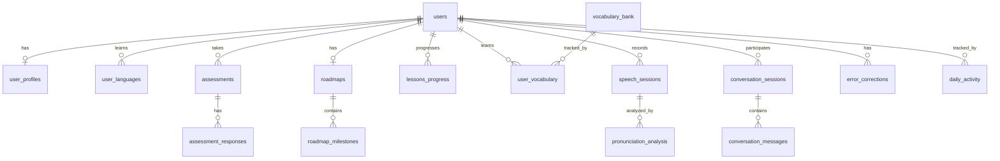

# MVP Architecture Redesign — AI Language Learning Platform

**Author:** Senior CTO Review  
**Date:** 2026-05-31  
**Context:** Redesigning the original 20-document specification for a realistic, ship-able MVP

---

## Table of Contents

1. Executive Summary — What Changed & Why
2. Simplified Architecture Diagram
3. MVP Feature Scope
4. Phase 2 & Phase 3 Separation
5. Database Schema
6. API Structure
7. AI System Design
8. Speech Processing Design
9. Infrastructure & Cost Estimate
10. Development Timeline
11. Team Requirements
12. Key Trade-off Decisions

---

## 1. Executive Summary — What Changed & Why

### Original Design Problems

| Original Choice | Problem | MVP Replacement |
|----------------|---------|-----------------|
| 11 microservices (NestJS + Python) | Premature distribution. Each service adds deployment, monitoring, networking overhead. A monolith handles 10K users easily. | Single NestJS monolith + 1 Python speech service |
| GraphQL Federation | Schema federation solves problems you don't have at 10K users. Adds massive complexity. | Simple REST API (Express-style routes) |
| RabbitMQ + Redis Pub/Sub | Two message buses for an MVP. Unnecessary. | Redis Pub/Sub only (single technology) |
| Elasticsearch | Full-text search for 10K users. PostgreSQL `tsvector` handles this. | PostgreSQL full-text search (GIN index) |
| 30+ database tables | Over-normalized for a product that doesn't exist yet. | 16 core tables, denormalized where practical |
| Kubernetes + Istio | Container orchestration + service mesh for an MVP. | ECS Fargate or single VM (Render/Railway) |
| Multi-region, cross-region replication | You don't have users on other continents yet. | Single region (us-east-1) |
| 12 languages at launch | 2 languages done well > 12 done poorly. | English + Hindi only |
| 16 conversation levels | 8 levels + 5 scenarios each is enough to validate. | 6 levels + 3 scenarios each |

### Guiding Principles for This Redesign

1. **Ship in 6 months** — Every decision serves this deadline
2. **Handle 10K DAU** — Not 1M. Scale up later.
3. **One team, one deploy** — Everyone pushes to one repo, one deployment
4. **AI is a library call, not a platform** — Call OpenAI/Deepgram APIs directly; don't build an AI platform
5. **PostgreSQL holds everything** — No Elasticsearch, no separate vector DB (pgvector), no search service
6. **Voice-first but text-always** — Voice is primary input, but everything works with text too

---

## 2. Simplified Architecture Diagram

```
┌──────────────────────────────────────────────────────────────┐
│                     Flutter Mobile App                        │
│                   (Android + iOS)                             │
│           on-device: VAD, basic noise reduction               │
└──────────────────────────┬───────────────────────────────────┘
                           │ HTTPS / WSS
                           ▼
┌──────────────────────────────────────────────────────────────┐
│                    Cloudflare CDN                              │
│               (static assets, audio cache)                    │
└──────────────────────────┬───────────────────────────────────┘
                           ▼
┌──────────────────────────────────────────────────────────────┐
│              Application Load Balancer (ALB)                  │
└──────────────────────────┬───────────────────────────────────┘
                           │
                           ▼
┌──────────────────────────────────────────────────────────────┐
│                                                               │
│              ┌──────────────────────────────┐                 │
│              │   NestJS Monolith             │                 │
│              │   (1 process, 2-4 replicas)   │                 │
│              │                               │                 │
│              │  Modules:                     │                 │
│              │  ├─ AuthModule                │                 │
│              │  ├─ UserModule                │                 │
│              │  ├─ AssessmentModule          │                 │
│              │  ├─ LearningModule            │                 │
│              │  ├─ ConversationModule (WS)   │                 │
│              │  ├─ VocabularyModule          │                 │
│              │  ├─ ProgressModule            │                 │
│              │  ├─ AdminModule (basic)       │                 │
│              │  └─ AIGateway (HTTP → LLMs)   │                 │
│              └──────────────┬───────────────┘                 │
│                             │                                 │
│              ┌──────────────▼───────────────┐                 │
│              │  Python Speech Service        │                 │
│              │  (FastAPI, 1 process)         │                 │
│              │  ├─ STT (Deepgram/Whisper)    │                 │
│              │  ├─ Pronunciation Analysis    │                 │
│              │  └─ TTS (ElevenLabs)          │                 │
│              └──────────────┬───────────────┘                 │
│                             │                                 │
└─────────────────────────────┼─────────────────────────────────┘
                              │
          ┌───────────────────┼───────────────────┐
          │                   │                   │
          ▼                   ▼                   ▼
┌─────────────────┐  ┌─────────────┐  ┌──────────────────┐
│  PostgreSQL 16   │  │   Redis 7   │  │  S3 (audio +      │
│  (1 writer)      │  │  (cache +   │  │  images)           │
│  pgvector ext    │  │   pub/sub)  │  │                   │
│  tsvector idx    │  │            │  │  TTL: 30d audio   │
└─────────────────┘  └─────────────┘  └──────────────────┘
                              │
                              ▼
                    ┌──────────────────┐
                    │  External APIs:   │
                    │  • OpenAI GPT-4o │
                    │  • Deepgram STT  │
                    │  • ElevenLabs TTS│
                    │  • SendGrid Email│
                    └──────────────────┘
```

### Why This Architecture?

| Decision | Why | Alternatives Rejected |
|----------|-----|----------------------|
| **Monolith (NestJS)** | 10K DAU needs ~10 req/s peak. A single optimized NestJS process handles this easily. One codebase, one deploy, zero service-discovery overhead. | 11 microservices (killed by complexity before you ship), Serverless Lambda (cold starts kill real-time speech) |
| **Single Python service** | Python is the best language for audio processing (librosa, webrtcvad, numpy). Keep it as a separate service because Python/NestJS process management differs, and speech processing is the one part that may need to scale independently later. | Embedding in NestJS (no good audio libraries), Multiple Python services (not needed yet) |
| **REST API** | Simple, well-understood, works with every client. GraphQL is solving a problem (over-fetching) that you don't have at MVP scale. | GraphQL Federation (over-engineering), gRPC (adds protobuf complexity, no benefit at this scale) |
| **PostgreSQL only** | One database to learn, monitor, backup. pgvector for embeddings, tsvector for search. Good for 10K users. | Separate Elasticsearch (operational overhead), Pinecone/Weaviate ($ + complexity), MongoDB (lose ACID for no benefit) |
| **Redis for everything** | Cache + pub/sub + rate limiting + session store. One technology, one connection pool. | RabbitMQ (operations overhead for MVP), Memcached (less capable than Redis) |
| **Cloudflare + ALB** | CDN for audio cache + DDoS protection. ALB for routing + health checks. | Kubernetes (you don't need orchestration for 2 services), Istio (6 months to configure, 0 value at this scale) |

---

## 3. MVP Feature Scope

### What Ships in 6 Months

```
▶ MUST HAVE (P0) — Core learning loop
▶ SHOULD HAVE (P1) — Completes the experience
▶ NICE TO HAVE (P2) — Can wait for Phase 2
```

### 3.1 User Onboarding & Assessment (P0)

| Feature | Why |
|---------|-----|
| Email + Google sign-up | Everyone has email or Google |
| Profile collection (name, age, native/target language, goal, time) | Needed for personalization |
| Microphone permission + test | Voice-first requires working mic |
| **Adaptive Placement Test** | Core differentiator — assesses listening, speaking, reading, writing, grammar, vocabulary, pronunciation |
| CEFR level determination (per-skill + overall) | Gives user a clear starting point |

### 3.2 Personalized Roadmap (P0)

| Feature | Why |
|---------|-----|
| AI-generated 3/6/12 month roadmap from assessment | Core differentiator — no other MVP offers this |
| Monthly goals (4 per month) | Gives structure |
| Weekly goals (specific, measurable) | Keeps user on track |
| Daily lesson plan (15-20 min, auto-generated) | The core daily experience |
| Revision schedule integrated | Spaced repetition needs a schedule |
| Checkpoint tests (weekly) | Measure progress |

### 3.3 Daily Lessons (P0)

| Feature | Why |
|---------|-----|
| AI-generated lesson (text + audio) | Fresh content every day |
| Exercise types: speaking (repeat), listening (MCQ), vocabulary, grammar | Multi-skill practice |
| Voice recording + analysis | Core voice-first experience |
| Pronunciation, fluency, grammar, confidence scores | Feedback that drives improvement |
| Lesson summary with weak areas | Closure + direction |

### 3.4 Pronunciation Scoring (P0)

| Feature | Why |
|---------|-----|
| **Phoneme-level scoring (0-100)** | Core differentiator — not just "good/bad" |
| Overall pronunciation score | Quick understanding |
| Error detection (substitution, deletion, insertion) | Specific feedback |
| Native audio reference | Target to aim for |
| Slow-motion audio (0.7x) | Helps hear details |

### 3.5 AI Conversation Simulator (P0) — Levels 1-6

| Feature | Why |
|---------|-----|
| 6 levels (Child through Shopping) | Covers beginner to intermediate |
| 3 scenarios per level | Enough variety to not be boring |
| Dynamic AI responses (LLM-powered) | Feels real, not scripted |
| Real-time corrections after each turn | Learn while doing |
| Voice input + output | Full voice loop |

**Why only 6 levels?** Levels 1-6 cover A1-B1 users, which is 70%+ of learners. Levels 7+ (B2-C2) can wait for Phase 2.

### 3.6 Error Correction Engine (P0)

| Feature | Why |
|---------|-----|
| Grammar error detection in speech | Most common error type |
| Pronunciation error detection | Core differentiator |
| Original → corrected display (diff view) | Clear before/after |
| Explanation ("why it's wrong") | Understand, not just memorize |
| 2-3 alternative natural phrasings | Learn flexibility |

### 3.7 Vocabulary System (P0)

| Feature | Why |
|---------|-----|
| Words introduced in context (sentence first) | Research-backed retention |
| Word card: meaning, pronunciation, examples, mistakes | Complete understanding |
| **Spaced repetition (SM-5)** | Proven algorithm for long-term memory |
| 3 review types: recognition, recall, sentence production | Multi-modal reinforcement |

### 3.8 Testing System (P0)

| Feature | Why |
|---------|-----|
| Daily quiz (5 min, auto-generated) | Consistent practice |
| Weekly assessment (15 min) | Track progress |
| Score tracking + history | See improvement over time |

### 3.9 Progress Dashboard (P0)

| Feature | Why |
|---------|-----|
| Today's summary (time, lessons, vocab) | Daily check-in |
| CEFR progression graph | Long-term motivation |
| Skill radar (6 skills) | Visualize strengths/weaknesses |
| Streak calendar | Consistency motivator |
| Recent sessions | Quick review access |

### 3.10 What We Deliberately Cut From MVP

| Feature | Phase | Why Not MVP |
|---------|-------|-------------|
| 16 conversation levels | Phase 2 | 6 levels covers 70% of learners |
| Pronunciation visualization (mouth diagrams) | Phase 2 | High UI effort, medium learning impact |
| Reading training module | Phase 2 | Reading alone doesn't build speaking |
| Writing training module | Phase 2 | Writing requires different assessment |
| Thinking in L2 mode | Phase 2 | Requires reading/writing foundation |
| AI teacher modes (6) | Phase 2 | 2 modes (Friendly + Professional) is enough |
| Gamification (achievements, leaderboards) | Phase 2 | Streaks alone drive consistency |
| Content library (stories, articles) | Phase 2 | AI-generated lesson content is sufficient |
| Multi-language parallel learning | Phase 3 | <5% of users need this |
| Offline mode | Phase 3 | High engineering cost, edge case |
| B2B features | Phase 3 | Focus on B2C product-market fit first |
| Web app (PWA) | Phase 2 | Mobile-first strategy; web adds platform testing cost |
| Admin panel (full) | Phase 2 | Manual DB operations work for MVP scale |

---

## 4. Phase 2 & Phase 3 Separation

### Phase 2 (Months 7-12) — Enhance & Expand

| Feature | Reason | Effort |
|---------|--------|--------|
| Spanish + French + German | Validate multi-language architecture | 8 weeks (3 languages) |
| Conversation levels 7-12 | B1-C1 learners need harder practice | 4 weeks |
| 3 more AI teacher modes | User testing shows demand for "Strict" and "Exam Coach" | 2 weeks |
| Pronunciation visualization (basic waveform) | Users want to "see" their pronunciation | 3 weeks |
| Reading + Writing modules | Completes the 4-skill set | 6 weeks |
| Thinking in L2 mode | Core differentiator for intermediate+ | 4 weeks |
| Web app (PWA) | Desktop users, admin panel | 6 weeks |
| Gamification (streaks, XP, levels) | Retention boost | 3 weeks |
| Admin panel (basic CRUD) | Reduce support burden | 4 weeks |

### Phase 3 (Months 13-18) — Scale & Monetize

| Feature | Reason | Effort |
|---------|--------|--------|
| Levels 13-16 + all scenarios | Complete conversation curriculum | 4 weeks |
| Japanese + Korean + Chinese | High-demand Asian languages | 12 weeks |
| Offline mode | India/emerging market requirement | 8 weeks |
| Advanced analytics dashboard | Retention optimization | 4 weeks |
| Subscription billing (Stripe) | Revenue | 3 weeks |
| Referral program | Growth | 2 weeks |
| Content library (50 stories per language) | Engagement depth | 6 weeks |
| Performance optimization for 100K users | Scale readiness | Ongoing |

---

## 5. Database Schema

**Total tables for MVP: 16** (down from 30+)

### 5.1 Entity Relationship Diagram



### 5.2 Table Definitions

#### users
```sql
CREATE TABLE users (
    id              UUID PRIMARY KEY DEFAULT gen_random_uuid(),
    email           VARCHAR(255) UNIQUE NOT NULL,
    password_hash   VARCHAR(255),
    auth_provider   VARCHAR(20) DEFAULT 'email',  -- 'email', 'google', 'apple'
    auth_provider_id VARCHAR(255),
    is_active       BOOLEAN DEFAULT true,
    created_at      TIMESTAMPTZ DEFAULT NOW(),
    updated_at      TIMESTAMPTZ DEFAULT NOW()
);
CREATE INDEX idx_users_email ON users(email) WHERE is_active = true;
```

#### user_profiles
```sql
CREATE TABLE user_profiles (
    id                UUID PRIMARY KEY DEFAULT gen_random_uuid(),
    user_id           UUID UNIQUE REFERENCES users(id),
    name              VARCHAR(255) NOT NULL,
    age               INTEGER CHECK(age >= 5 AND age <= 120),
    country_code      VARCHAR(3) NOT NULL,
    native_language   VARCHAR(10) NOT NULL,
    learning_goal     VARCHAR(50) NOT NULL,  -- 'travel', 'career', 'exams', 'migration', 'general'
    daily_study_min   INTEGER CHECK(daily_study_min >= 5 AND daily_study_min <= 180),
    learning_style    VARCHAR(20) DEFAULT 'mixed',  -- 'visual', 'auditory', 'reading', 'mixed'
    teacher_mode      VARCHAR(20) DEFAULT 'friendly',  -- 'friendly', 'professional'
    onboarding_complete BOOLEAN DEFAULT false,
    created_at        TIMESTAMPTZ DEFAULT NOW(),
    updated_at        TIMESTAMPTZ DEFAULT NOW()
);
```

#### user_languages
```sql
CREATE TABLE user_languages (
    id              UUID PRIMARY KEY DEFAULT gen_random_uuid(),
    user_id         UUID REFERENCES users(id),
    language_code   VARCHAR(10) NOT NULL,  -- 'en', 'hi'
    goal_cefr       VARCHAR(3) NOT NULL,
    is_primary      BOOLEAN DEFAULT true,
    UNIQUE(user_id, language_code)
);
```

#### assessments
```sql
CREATE TABLE assessments (
    id              UUID PRIMARY KEY DEFAULT gen_random_uuid(),
    user_id         UUID REFERENCES users(id),
    language_code   VARCHAR(10) NOT NULL,
    type            VARCHAR(20) NOT NULL,  -- 'placement', 'daily_quiz', 'weekly'
    status          VARCHAR(20) DEFAULT 'in_progress',
    overall_score   DECIMAL(5,2),
    overall_cefr    VARCHAR(3),
    started_at      TIMESTAMPTZ DEFAULT NOW(),
    completed_at    TIMESTAMPTZ,
    duration_sec    INTEGER
);
CREATE INDEX idx_assessments_user ON assessments(user_id, created_at DESC);
```

#### assessment_responses
```sql
CREATE TABLE assessment_responses (
    id                  UUID PRIMARY KEY DEFAULT gen_random_uuid(),
    assessment_id       UUID REFERENCES assessments(id),
    section_type        VARCHAR(20) NOT NULL,  -- 'listening', 'speaking', 'reading', 'writing', 'vocab', 'grammar'
    question_type       VARCHAR(20) NOT NULL,  -- 'mcq', 'speaking', 'fill_blank'
    content             JSONB NOT NULL,         -- question content
    user_response       JSONB,
    is_correct          BOOLEAN,
    score               DECIMAL(5,2),
    ai_feedback         TEXT,
    audio_url           TEXT,
    response_time_ms    INTEGER,
    difficulty          INTEGER DEFAULT 1,
    created_at          TIMESTAMPTZ DEFAULT NOW()
);
CREATE INDEX idx_assessment_responses_assessment ON assessment_responses(assessment_id);
```

#### roadmaps
```sql
CREATE TABLE roadmaps (
    id                UUID PRIMARY KEY DEFAULT gen_random_uuid(),
    user_id           UUID REFERENCES users(id),
    language_code     VARCHAR(10) NOT NULL,
    duration_months   INTEGER CHECK(duration_months IN (3, 6, 12)),
    start_date        DATE NOT NULL,
    end_date          DATE NOT NULL,
    current_cefr      VARCHAR(3) NOT NULL,
    target_cefr       VARCHAR(3) NOT NULL,
    is_active         BOOLEAN DEFAULT true,
    generated_at      TIMESTAMPTZ DEFAULT NOW()
);
CREATE INDEX idx_roadmaps_user ON roadmaps(user_id, language_code);
```

#### roadmap_milestones
```sql
CREATE TABLE roadmap_milestones (
    id              UUID PRIMARY KEY DEFAULT gen_random_uuid(),
    roadmap_id      UUID REFERENCES roadmaps(id),
    month_number    INTEGER NOT NULL,
    title           VARCHAR(255) NOT NULL,
    description     TEXT,
    is_completed    BOOLEAN DEFAULT false,
    completed_at    TIMESTAMPTZ,
    sort_order      INTEGER NOT NULL
);
CREATE INDEX idx_roadmap_milestones_roadmap ON roadmap_milestones(roadmap_id);
```

#### lessons_progress (denormalized — one row per user-lesson)
```sql
CREATE TABLE lessons_progress (
    id                  UUID PRIMARY KEY DEFAULT gen_random_uuid(),
    user_id             UUID REFERENCES users(id),
    lesson_date         DATE NOT NULL DEFAULT CURRENT_DATE,
    title               VARCHAR(255) NOT NULL,
    cefr_level          VARCHAR(3) NOT NULL,
    status              VARCHAR(20) DEFAULT 'in_progress',  -- 'assigned', 'in_progress', 'completed'
    score               DECIMAL(5,2),
    time_spent_sec      INTEGER DEFAULT 0,
    exercises_total     INTEGER DEFAULT 0,
    exercises_completed INTEGER DEFAULT 0,
    content             JSONB,  -- denormalized lesson content snapshot
    weak_areas          TEXT[] DEFAULT '{}',
    vocabulary_learned  TEXT[] DEFAULT '{}',
    started_at          TIMESTAMPTZ,
    completed_at        TIMESTAMPTZ,
    created_at          TIMESTAMPTZ DEFAULT NOW(),
    updated_at          TIMESTAMPTZ DEFAULT NOW(),
    UNIQUE(user_id, lesson_date)
);
CREATE INDEX idx_lessons_progress_user ON lessons_progress(user_id, lesson_date DESC);
```

**Why denormalize lesson content?** Lessons are AI-generated and not reused (each user gets a unique lesson). Storing a separate `lessons` table with normalized exercises adds JOIN complexity for zero benefit. The JSONB content snapshot allows the progress record to be self-contained.

#### vocabulary_bank
```sql
CREATE TABLE vocabulary_bank (
    id              UUID PRIMARY KEY DEFAULT gen_random_uuid(),
    language_code   VARCHAR(10) NOT NULL,
    word            VARCHAR(255) NOT NULL,
    transliteration VARCHAR(255),
    phonetic        VARCHAR(100),
    part_of_speech  VARCHAR(30),
    cefr_level      VARCHAR(3),
    frequency_rank  INTEGER,
    definitions     JSONB,       -- [{meaning, language}]
    examples        JSONB,       -- [{sentence, translation}]
    synonyms        TEXT[],
    common_mistakes JSONB,       -- [{error, correction}]
    audio_url       TEXT,
    topic_tags      TEXT[],
    UNIQUE(language_code, word)
);
CREATE INDEX idx_vocab_bank_cefr ON vocabulary_bank(language_code, cefr_level);
```

#### user_vocabulary
```sql
CREATE TABLE user_vocabulary (
    id              UUID PRIMARY KEY DEFAULT gen_random_uuid(),
    user_id         UUID REFERENCES users(id),
    vocabulary_id   UUID REFERENCES vocabulary_bank(id),
    status          VARCHAR(20) DEFAULT 'new',  -- 'new', 'learning', 'reviewing', 'mastered'
    familiarity     INTEGER DEFAULT 0,  -- 0-100
    times_seen      INTEGER DEFAULT 0,
    times_correct   INTEGER DEFAULT 0,
    times_wrong     INTEGER DEFAULT 0,
    next_review_at  TIMESTAMPTZ DEFAULT NOW(),
    interval_sec    BIGINT DEFAULT 0,
    ease_factor     DECIMAL(4,2) DEFAULT 2.50,
    UNIQUE(user_id, vocabulary_id)
);
CREATE INDEX idx_user_vocab_review ON user_vocabulary(user_id, next_review_at)
    WHERE status != 'mastered';
```

#### speech_sessions
```sql
CREATE TABLE speech_sessions (
    id                  UUID PRIMARY KEY DEFAULT gen_random_uuid(),
    user_id             UUID REFERENCES users(id),
    session_type        VARCHAR(20) NOT NULL,  -- 'exercise', 'conversation', 'assessment'
    reference_id        UUID,          -- FK to exercise/conversation/assessment
    language_code       VARCHAR(10) NOT NULL,
    duration_ms         INTEGER,
    audio_url           TEXT NOT NULL,
    transcription_text  TEXT,
    transcription_conf  DECIMAL(4,3),
    noise_level_db      DECIMAL(5,2),
    status              VARCHAR(20) DEFAULT 'processing',  -- 'processing', 'completed', 'failed'
    created_at          TIMESTAMPTZ DEFAULT NOW()
);
CREATE INDEX idx_speech_sessions_user ON speech_sessions(user_id, created_at DESC);
```

#### pronunciation_analysis
```sql
CREATE TABLE pronunciation_analysis (
    id                  UUID PRIMARY KEY DEFAULT gen_random_uuid(),
    speech_session_id   UUID UNIQUE REFERENCES speech_sessions(id),
    overall_score       DECIMAL(5,2) NOT NULL,
    fluency_score       DECIMAL(5,2),
    grammar_score       DECIMAL(5,2),
    confidence_score    DECIMAL(5,2),
    phoneme_scores      JSONB,   -- [{phoneme, ipa, score, expected}]
    prosody_metrics     JSONB,   -- {wpm, pause_ratio, filler_count, stress_score, intonation}
    errors_detected     JSONB,   -- [{type, incorrect, correct}]
    l1_influences       TEXT[],
    created_at          TIMESTAMPTZ DEFAULT NOW()
);
```

**Why JSONB for phoneme scores?** Each utterance has a variable number of phonemes. A separate `phoneme_scores` table would require JOINs for every read. JSONB is queryable (you can `phoneme_scores->'score'`) and keeps the analysis self-contained.

#### conversation_sessions
```sql
CREATE TABLE conversation_sessions (
    id              UUID PRIMARY KEY DEFAULT gen_random_uuid(),
    user_id         UUID REFERENCES users(id),
    language_code   VARCHAR(10) NOT NULL,
    level           INTEGER CHECK(level BETWEEN 1 AND 6),
    scenario        VARCHAR(255) NOT NULL,
    duration_ms     BIGINT,
    message_count   INTEGER DEFAULT 0,
    avg_score       DECIMAL(5,2),
    status          VARCHAR(20) DEFAULT 'in_progress',  -- 'in_progress', 'completed'
    summary         TEXT,
    created_at      TIMESTAMPTZ DEFAULT NOW(),
    updated_at      TIMESTAMPTZ DEFAULT NOW()
);
```

#### conversation_messages
```sql
CREATE TABLE conversation_messages (
    id              UUID PRIMARY KEY DEFAULT gen_random_uuid(),
    session_id      UUID REFERENCES conversation_sessions(id),
    sender          VARCHAR(10) NOT NULL,  -- 'user', 'ai'
    message_order   INTEGER NOT NULL,
    text            TEXT NOT NULL,
    audio_url       TEXT,
    transcription   TEXT,
    corrections     JSONB,   -- [{incorrect, correct, explanation}]
    created_at      TIMESTAMPTZ DEFAULT NOW()
);
CREATE INDEX idx_conv_messages_session ON conversation_messages(session_id, message_order);
```

#### error_corrections
```sql
CREATE TABLE error_corrections (
    id                  UUID PRIMARY KEY DEFAULT gen_random_uuid(),
    user_id             UUID REFERENCES users(id),
    language_code       VARCHAR(10) NOT NULL,
    source              VARCHAR(20) NOT NULL,  -- 'exercise', 'conversation', 'assessment'
    source_id           UUID,
    category            VARCHAR(30) NOT NULL,  -- 'phonological', 'morphological', 'syntactic', 'lexical'
    subcategory         VARCHAR(50),
    incorrect_text      TEXT NOT NULL,
    correct_text        TEXT NOT NULL,
    explanation         TEXT,
    alternatives        TEXT[],
    severity            VARCHAR(10) DEFAULT 'minor',
    created_at          TIMESTAMPTZ DEFAULT NOW()
);
CREATE INDEX idx_errors_user ON error_corrections(user_id, language_code, created_at DESC);
```

#### daily_activity
```sql
CREATE TABLE daily_activity (
    id                  UUID PRIMARY KEY DEFAULT gen_random_uuid(),
    user_id             UUID REFERENCES users(id),
    date                DATE NOT NULL,
    total_minutes       INTEGER DEFAULT 0,
    lessons_completed   INTEGER DEFAULT 0,
    exercises_done      INTEGER DEFAULT 0,
    vocab_reviewed      INTEGER DEFAULT 0,
    conversations_had   INTEGER DEFAULT 0,
    avg_score           DECIMAL(5,2),
    streak_day          INTEGER DEFAULT 0,
    UNIQUE(user_id, date)
);
CREATE INDEX idx_daily_activity_user ON daily_activity(user_id, date DESC);
```

### 5.3 Index Strategy (Only What We Need)

```sql
-- Auth (fast login)
CREATE INDEX CONCURRENTLY idx_users_email_active ON users(email) WHERE is_active = true;

-- Daily lesson fetch (most common query)
CREATE INDEX CONCURRENTLY idx_lessons_progress_today ON lessons_progress(user_id, lesson_date DESC);

-- Spaced repetition queue (runs every session)
CREATE INDEX CONCURRENTLY idx_vocab_review_due ON user_vocabulary(user_id, next_review_at)
    WHERE status IN ('learning', 'reviewing');

-- Recent activity (dashboard query)
CREATE INDEX CONCURRENTLY idx_activity_recent ON daily_activity(user_id, date DESC);

-- Error analysis (personalization query)
CREATE INDEX CONCURRENTLY idx_errors_recent ON error_corrections(user_id, created_at DESC);

-- Full-text search for vocabulary bank
ALTER TABLE vocabulary_bank ADD COLUMN search_vector tsvector
    GENERATED ALWAYS AS (
        to_tsvector('simple', coalesce(word, '') || ' ' || coalesce(transliteration, ''))
    ) STORED;
CREATE INDEX idx_vocab_search ON vocabulary_bank USING GIN(search_vector);
```

### 5.4 Why This Schema (Not the Original)

| Original (30+ tables) | MVP (16 tables) | Why |
|----------------------|-----------------|-----|
| Separate `lessons`, `lesson_exercises`, `exercise_attempts` | `lessons_progress` with JSONB content | AI-generated lessons aren't reused; storing exercise structure in a separate table with JOINs for every read adds complexity for zero benefit. JSONB is queryable. |
| `vocabulary_examples`, `vocabulary_mistakes` tables | JSONB arrays in `vocabulary_bank` | Examples and mistakes always read with the word. No need for separate JOINs. |
| `user_gamification`, `achievements`, `user_achievements` | Cut entirely (Phase 2) | Gamification is NOT in MVP scope. |
| `content_library`, `content_interactions` | Cut entirely (Phase 2) | Content library is NOT in MVP scope. |
| `grammar_rules` | JSON array in `error_corrections` | Grammar rules can be embedded in correction explanations; a full grammar rule engine is Phase 2. |
| `admin_users`, `admin_audit_log` | Cut (Phase 2) | MVP admin = direct DB access + 1 basic endpoint. |
| `user_devices` | Cut | Push notifications can use a simple token stored on `users` or cut entirely for MVP. |

---

## 6. API Structure

### 6.1 Design Decisions

| Decision | Choice | Why |
|----------|--------|-----|
| Protocol | REST (OpenAPI 3.0) | Universal client support, simplest debugging, works with all tools |
| Versioning | URL prefix `/v1/` | Simple, explicit, easy to maintain |
| Auth | Bearer JWT (access 15min + refresh 7d) | Standard, stateless, no DB lookup on each request |
| Rate limiting | Express-rate-limit (in-process) | No external dependency needed for 10K users |
| Pagination | Cursor-based for lists | Consistent, performant |
| Error format | `{ error: { code, message, details } }` | Consistent, machine-readable |

### 6.2 Endpoints

#### Auth
```
POST   /v1/auth/register          # Email + password registration
POST   /v1/auth/login             # Email/password or OAuth token
POST   /v1/auth/refresh           # Refresh token
POST   /v1/auth/logout            # Invalidate refresh token
POST   /v1/auth/oauth/{provider}  # Google/Apple login
```

#### User
```
GET    /v1/users/me               # Current user profile
PUT    /v1/users/me/profile       # Update profile
PUT    /v1/users/me/preferences   # Update preferences (teacher_mode, daily_time)
DELETE /v1/users/me               # Account deletion
```

#### Assessment
```
POST   /v1/assessments/placement              # Start placement test
GET    /v1/assessments/placement/{id}/next     # Get next question
POST   /v1/assessments/placement/{id}/response # Submit answer
POST   /v1/assessments/placement/{id}/speaking # Submit audio response
GET    /v1/assessments/placement/{id}/results  # Get results + CEFR
```

#### Roadmap
```
GET    /v1/roadmaps                # Get user's active roadmap
GET    /v1/roadmaps/{id}/goals     # Get goals for current month
GET    /v1/roadmaps/{id}/today     # Get today's lesson plan
```

#### Lessons
```
GET    /v1/lessons/today           # Get today's lesson (AI-generated on first fetch)
POST   /v1/lessons/{id}/exercises/{exerciseId}/attempt  # Submit exercise
GET    /v1/lessons/{id}/summary    # Get lesson completion summary
```

#### Conversation
```
WSS    /v1/conversations/{sessionId}  # WebSocket conversation session
POST   /v1/conversations              # Start new conversation
POST   /v1/conversations/{id}/end     # End session, get summary
```

#### Vocabulary
```
GET    /v1/vocabulary/due          # Get due reviews (limit, language)
POST   /v1/vocabulary/review       # Submit review result (quality score)
GET    /v1/vocabulary/bank         # Search vocabulary bank (q, level, limit)
```

#### Progress
```
GET    /v1/progress/summary        # Dashboard data (skills, streak, activity)
GET    /v1/progress/activity       # Daily activity log (from, to)
GET    /v1/progress/assessments    # Assessment history
GET    /v1/progress/errors         # Error profile (weak areas)
```

#### Speech
```
POST   /v1/speech/analyze          # Upload audio, get pronunciation scores
POST   /v1/speech/tts              # Generate TTS audio from text
```

### 6.3 Key Design Decisions

**Why no GraphQL?** GraphQL is solving over-fetching/under-fetching. At MVP scale with a mobile app, you control the client. You can optimize queries on both ends. GraphQL adds schema complexity, resolver federation, and caching challenges. REST with proper field selection (`?fields=id,name`) handles the same problem with less complexity.

**Why one `/lessons/today` endpoint instead of a lesson CRUD?** Lessons are AI-generated per-user and not shared. There's no "edit lesson" or "delete lesson" flow. The endpoint generates a lesson on first access (or returns cached), and the user works through it.

**Why REST for conversation start/end + WebSocket for live?** Starting/ending a conversation is a simple REST call. The live turn-by-turn interaction uses WebSocket for low-latency bidirectional communication. This is the only place WebSocket is justified.

---

## 7. AI System Design

### 7.1 Architecture

```
                    ┌──────────────────────────────┐
                    │     NestJS Monolith           │
                    │                               │
                    │  AIGateway Module              │
                    │  ┌────────────────────────┐   │
                    │  │  ModelRouter            │   │
                    │  │  ├─ generate_content()  │   │
                    │  │  ├─ generate_convo()    │   │
                    │  │  ├─ correct_errors()   │   │
                    │  │  └─ score_writing()    │   │
                    │  └────────────────────────┘   │
                    │                               │
                    │  ┌────────────────────────┐   │
                    │  │  PromptManager          │   │
                    │  │  ├─ lesson.prompt.txt   │   │
                    │  │  ├─ conversation.prompt │   │
                    │  │  ├─ correction.prompt   │   │
                    │  │  └─ assessment.prompt   │   │
                    │  └────────────────────────┘   │
                    │                               │
                    │  ┌────────────────────────┐   │
                    │  │  ResponseCache          │   │
                    │  │  (Redis, 15-20% hit)   │   │
                    │  └────────────────────────┘   │
                    └─────────────┬─────────────────┘
                                  │ HTTPS
                    ┌─────────────▼─────────────────┐
                    │  OpenAI / Anthropic API         │
                    │  (GPT-4o, GPT-4o-mini)         │
                    └───────────────────────────────┘
```

### 7.2 Model Selection (Simple If-Else, Not a Router)

```typescript
// ai-gateway.ts — Dead simple, not over-engineered
function selectModel(task: TaskType, isPremium: boolean): ModelConfig {
  if (task === 'lesson_generation') {
    return { model: 'gpt-4o', maxTokens: 4096, temperature: 0.7 };
  }

  if (task === 'conversation') {
    // 80% of conversations use cheap model
    return { model: 'gpt-4o-mini', maxTokens: 1024, temperature: 0.8 };
  }

  if (task === 'error_correction') {
    return { model: 'gpt-4o-mini', maxTokens: 512, temperature: 0.2 };
  }

  if (task === 'assessment_scoring') {
    return { model: 'gpt-4o', maxTokens: 1024, temperature: 0.3 };
  }

  if (task === 'roadmap_generation') {
    return { model: 'gpt-4o', maxTokens: 2048, temperature: 0.6 };
  }

  // Default: cheap model
  return { model: 'gpt-4o-mini', maxTokens: 1024, temperature: 0.5 };
}
```

**Why not a complex model router with fallbacks and queues?** You have 2 models (GPT-4o and GPT-4o-mini). A simple if-else handles this. If GPT-4o is down, you have a bigger problem than your routing logic. Add fallback when you have 5+ models.

### 7.3 Prompt Template Strategy

Templates stored as TypeScript template strings (not a separate store):

```typescript
// prompts/lesson.ts
export function buildLessonPrompt(user: UserProfile, weakAreas: string[]): string {
  return `
You are a language teacher creating a 15-minute lesson for a ${user.age}-year-old ${user.native_language} speaker learning ${user.target_language}.

Student level: ${user.cefr_level}
Student's weak areas: ${weakAreas.join(', ')}
Goal: ${user.learning_goal}

Create a lesson with 6 exercises:
1. A short listening dialogue (4-6 lines) with 2 comprehension questions
2. A speaking exercise: repeat a key sentence
3. A vocabulary exercise: match 3 new words to their meanings
4. A grammar exercise: fill in the blank
5. A pronunciation exercise: minimal pairs
6. A conversation prompt

Output as JSON:
{
  "title": "...",
  "dialogue": { "speakers": [...], "lines": [...], "audio_script": "..." },
  "exercises": [
    { "type": "listening", "question": "...", "options": [...], "answer": 0 },
    { "type": "speaking", "prompt": "...", "reference_text": "..." },
    ...
  ],
  "vocabulary": [
    { "word": "...", "meaning": "...", "example": "..." }
  ],
  "grammar_focus": "..."
}

IMPORTANT: Use vocabulary at ${user.cefr_level} level or below.
IMPORTANT: Make the content relevant to ${user.learning_goal}.
The response must be valid JSON only, no markdown.`;
}
```

**Why not a prompt management system with versioning and A/B testing?** You have 6 prompt templates. They change infrequently. Git versioning is sufficient. Add a prompt management system when you have 50+ prompts and 3 people editing them.

### 7.4 Caching Strategy

```typescript
// Simple Redis cache wrapper
class AICache {
  async getOrSet<T>(key: string, ttlSec: number, fn: () => Promise<T>): Promise<T> {
    const cached = await redis.get(key);
    if (cached) return JSON.parse(cached);

    const result = await fn();

    // Only cache if result is useful
    await redis.setex(key, ttlSec, JSON.stringify(result));
    return result;
  }
}

// Usage
const lesson = await cache.getOrSet(
  `lesson:${userId}:${today}`,
  7200,  // 2 hours
  () => generateLesson(user)
);
```

**What we cache:**
- Today's lesson: 2 hours (regenerated if >2h old, rare case)
- Conversation responses for common inputs: 1 hour
- Vocabulary definitions: 24 hours
- Assessment questions: 1 hour (same question bank reused)

**What we don't cache:** Real-time conversation turns (every turn is unique).

### 7.5 Cost Control

```typescript
// Per-user cost tracking
class AICostGuard {
  private readonly DAILY_LIMIT_CENTS = {
    free: 10,   // $0.10/user/day
    basic: 30,  // $0.30/user/day
  };

  async checkQuota(userId: string): Promise<boolean> {
    const today = await redis.get(`cost:${userId}:${today()}`);
    const user = await getUserTier(userId);
    return (parseInt(today) || 0) < this.DAILY_LIMIT_CENTS[user.tier];
  }

  async trackCost(userId: string, costCents: number): Promise<void> {
    await redis.incrby(`cost:${userId}:${today()}`, costCents);
    await redis.expire(`cost:${userId}:${today()}`, 86400);
  }
}
```

### 7.6 Why This AI Design (Not the Original)

| Original | MVP | Why |
|----------|-----|-----|
| LLM Orchestrator as separate Python service | NestJS module | One less service to deploy. NestJS can make HTTP calls just as well. |
| gRPC for AI service communication | Direct HTTPS | gRPC adds protobuf compilation, service discovery. HTTP is fine for 10K users. |
| Complex model router with fallback priorities | Simple if-else | You have 2 models. Don't build a router for 2 models. |
| Prompt management system with versioning | TypeScript template strings | 6 prompts don't need a management system. Git is fine. |
| Full RAG pipeline with reranking | Simple prompt + context | RAG is for large knowledge bases. A lesson prompt fits in context window. Add RAG when you have 10K+ content items. |
| Fine-tuned models | Prompt engineering | Fine-tuning is useful when you have 100K+ annotated examples and need to reduce cost by 10x. At MVP scale, prompt engineering achieves good results at $0.012/session. |

---

## 8. Speech Processing Design

### 8.1 Architecture

```
┌─────────────────────────────┐
│       Flutter App            │
│  ┌───────────────────────┐   │
│  │ On-device:            │   │
│  │ • VAD (webrtc)       │   │
│  │ • Noise reduction     │   │
│  │ • Opus encoding       │   │
│  └───────────────────────┘   │
└─────────────┬───────────────┘
              │ WSS / HTTPS
              ▼
┌─────────────────────────────┐
│  Python Speech Service       │
│  (FastAPI, 1 process)        │
│                              │
│  ┌───────────────────────┐   │
│  │ REST Endpoints:        │   │
│  │ POST /analyze          │   │
│  │ POST /tts              │   │
│  └───────────────────────┘   │
│                              │
│  ┌───────────────────────┐   │
│  │ Streaming (WSS):      │   │
│  │ /stream-transcribe    │   │
│  │ /stream-conversation  │   │
│  └───────────────────────┘   │
│                              │
│  ┌───────────────────────┐   │
│  │ Modules:               │   │
│  │ • STT (Deepgram SDK)   │   │
│  │ • PronAnalyzer         │   │
│  │ • TTS (ElevenLabs SDK) │   │
│  └───────────────────────┘   │
└──────┬──────────────────────┘
       │
       ▼
┌──────────────────────┐
│ External APIs:        │
│ • Deepgram Nova-2     │
│ • ElevenLabs TTS      │
│ • (or Whisper API)    │
└──────────────────────┘
```

### 8.2 Speech-to-Text

```python
# speech_service/stt.py — Simple, direct API calls
class STTService:
    def __init__(self):
        self.deepgram = Deepgram(Config.DEEPGRAM_API_KEY)

    async def transcribe(self, audio: bytes, language: str) -> STTResult:
        """Non-streaming STT for exercises and assessments."""
        response = await self.deepgram.transcription.prerecorded(
            {"buffer": audio, "mimetype": "audio/wav"},
            {"language": language, "punctuate": True, "model": "nova-2"}
        )
        return self._parse_response(response)

    async def transcribe_stream(self, audio_stream: AsyncIterator[bytes], language: str) -> AsyncIterator[STTChunk]:
        """Streaming STT for conversation."""
        async for chunk in self.deepgram.transcription.streaming(audio_stream, {"language": language}):
            yield STTChunk(
                text=chunk.channel.alternatives[0].transcript,
                is_final=chunk.is_final,
                confidence=chunk.channel.alternatives[0].confidence
            )
```

### 8.3 Pronunciation Analysis

```python
# speech_service/pronunciation.py — The core differentiator
class PronunciationAnalyzer:
    def __init__(self):
        # Montreal Forced Aligner for phoneme alignment
        self.aligner = MontrealForcedAligner()

    async def analyze(self, audio: bytes, expected_text: str, language: str,
                      native_language: str) -> PronunciationResult:
        # Step 1: Transcribe (what user actually said)
        stt = await STTService().transcribe(audio, language)

        # Step 2: Force-align expected text to audio
        alignment = self.aligner.align(expected_text, audio, language)

        # Step 3: Score each phoneme
        phoneme_scores = []
        for expected_phoneme, actual_phoneme in alignment.phoneme_pairs:
            if expected_phoneme == actual_phoneme:
                score = 70 + (self._acoustic_similarity(expected_phoneme, actual_phoneme) * 30)
            else:
                distance = self._phoneme_distance(expected_phoneme, actual_phoneme)
                score = max(0, 50 - (distance * 50))

            phoneme_scores.append({
                "phoneme": expected_phoneme.ipa,
                "score": round(score, 1),
                "expected": expected_phoneme,
                "actual": actual_phoneme,
                "is_error": score < 70
            })

        # Step 4: Compute composite scores
        # Pronunciation = phoneme accuracy (40%) + stress (20%) + intonation (20%) + rhythm (10%) + fluency (10%)
        prosody = self._analyze_prosody(audio, alignment)
        l1_issues = self._detect_l1_interference(alignment, native_language, language)
        composite = self._compute_composite(phoneme_scores, prosody, l1_issues)

        return PronunciationResult(
            transcription=stt.text,
            phoneme_scores=phoneme_scores,
            overall=composite.pronunciation,
            fluency=composite.fluency,
            grammar=composite.grammar,
            confidence=composite.confidence,
            prosody=prosody,
            l1_interferences=l1_issues,
            feedback=self._generate_feedback(composite, l1_issues)
        )

    def _phoneme_distance(self, p1: Phoneme, p2: Phoneme) -> float:
        """Simple phonological distance based on articulatory features."""
        features1 = self._articulatory_features(p1)
        features2 = self._articulatory_features(p2)
        return sum(
            w * abs(features1[k] - features2[k])
            for k, w in {
                'place': 0.3, 'manner': 0.3, 'voicing': 0.2,
                'vowel_height': 0.1, 'vowel_backness': 0.1
            }.items()
        )

    def _detect_l1_interference(self, alignment, l1: str, l2: str) -> list:
        """Look up known L1->L2 error patterns."""
        patterns = L1_INTERFERENCE_MAP.get(f"{l1}->{l2}", {})
        detected = []
        for phoneme, pattern in patterns.items():
            if any(p.ipa == phoneme and p.score < 70 for p in alignment.phoneme_pairs):
                detected.append({
                    "phoneme": phoneme,
                    "l1_substitute": pattern.substitute,
                    "explanation": pattern.explanation,
                    "correction_guide": pattern.correction_guide
                })
        return detected
```

**Why Montreal Forced Aligner over a custom trained model?** MFA is free, open-source, supports 100+ languages, and provides phone-level alignment accurate enough for pronunciation scoring. A custom trained model is Phase 3 work.

### 8.4 L1 Interference Map (MVP)

```python
# Minimal — just the most common patterns per language pair
L1_INTERFERENCE_MAP = {
    "hi->en": {
        "θ": {"substitute": "t̪", "explanation": "Hindi lacks /θ/. Replace with dental /t̪/.",
              "correction_guide": "Place tongue between teeth and blow air."},
        "ð": {"substitute": "d̪", "explanation": "Hindi lacks /ð/. Replace with dental /d̪/.",
              "correction_guide": "Place tongue between teeth and vibrate vocal cords."},
        "w": {"substitute": "ʋ", "explanation": "Hindi /ʋ/ is between /v/ and /w/.",
              "correction_guide": "Round lips more for /w/."},
        "v": {"substitute": "ʋ", "explanation": "Hindi /ʋ/ is between /v/ and /w/.",
              "correction_guide": "Touch upper teeth to lower lip for /v/."},
    },
    # Add more language pairs as they're added
}
```

**Why a hardcoded map instead of an ML model?** L1 interference is well-studied. A hand-crafted map of the top 10-20 patterns per language pair covers 80%+ of errors. An ML model is Phase 3.

### 8.5 Text-to-Speech

```python
class TTSService:
    def __init__(self):
        self.client = ElevenLabs(Config.ELEVENLABS_API_KEY)

    async def synthesize(self, text: str, language: str, speed: str = "normal") -> bytes:
        """Generate TTS audio. Speed: 'slow' (0.7x), 'normal' (1.0x), 'fast' (1.2x)."""
        voice = self._get_voice(language)
        audio = await self.client.generate(text=text, voice=voice)

        if speed != "normal":
            audio = self._time_stretch(audio, self.SPEED_FACTORS[speed])

        return audio
```

**Why ElevenLabs over Azure/Google?** ElevenLabs has the most natural-sounding voices across languages. For a voice-first app, audio quality directly impacts user trust and engagement. Cost ($0.001/session) is worth it.

### 8.6 Why This Speech Design (Not the Original)

| Original | MVP | Why |
|----------|-----|-----|
| 3 STT models per language (primary + fallback + on-device) | 1 STT per language (Deepgram for EN, Whisper for HI) | Having 3 models adds integration complexity. If Deepgram is down, fallback to Whisper. You don't need 3 models configured from day one. |
| Separate pronunciation scoring microservice | Python module in speech service | It's 300 lines of code, not a microservice. |
| Real-time streaming for all exercises | Streaming for conversation only, batch for exercises | Exercises are < 30s. Batch processing with 2s latency is fine. Streaming adds complexity that only benefits conversation. |
| On-device TensorFlow Lite phoneme classifier | WebRTC VAD only on-device | A TFLite model for basic phoneme scoring adds 2MB to app size and maintenance burden. At MVP stage, send audio to server. You can add on-device when cloud costs become a problem. |
| L1 interference ML model | Hardcoded pattern map | The top 20 patterns cover 80% of errors. An ML model is Phase 3. |

---

## 9. Infrastructure & Cost Estimate

### 9.1 Infrastructure (10K DAU)

| Component | Specification | Monthly Cost |
|-----------|--------------|--------------|
| **Compute** — ECS Fargate | NestJS: 2 vCPU, 4GB (2 replicas). Python: 1 vCPU, 2GB (1 replica) | ~$180 |
| **Database** — RDS PostgreSQL 16 | db.t4g.medium (2 vCPU, 4GB), 50GB gp3, no Multi-AZ | ~$60 |
| **Cache** — ElastiCache Redis | cache.t4g.micro (0.5GB) — enough for session + cache + pub/sub | ~$15 |
| **Storage** — S3 | Audio: 50GB/mo. Images: 5GB. Lifecycle: 30d → IA | ~$5 |
| **CDN** — CloudFront | 100GB transfer, 1M requests | ~$10 |
| **Load Balancer** — ALB | 1 ALB, 5GB processed | ~$25 |
| **Email** — SendGrid | 10K emails/mo (free tier) | $0 |
| **Monitoring** — Sentry + CloudWatch | Sentry Team ($26/mo) + basic CloudWatch | ~$35 |
| **Subtotal Infrastructure** | | **~$330/mo** |

### 9.2 AI/API Costs (10K DAU, 15 min avg session)

| Service | Usage/Month | Cost |
|---------|-------------|------|
| **STT** — Deepgram Nova-2 | 10K users × 3 sessions/day × 2 min audio = 60K min | ~$258 |
| **TTS** — ElevenLabs | 10K users × 20 sentences/day = 200K sentences | ~$200 |
| **LLM** — OpenAI GPT-4o/4o-mini | 10K users × 3 sessions × ~2K tokens = 60M tokens | ~$400 |
| **Embeddings** — OpenAI text-embedding-3-small | Minimal (only for vocab search) | ~$20 |
| **Subtotal AI** | | **~$878/mo** |

### 9.3 Total Monthly Cost

| Category | Cost |
|----------|------|
| Infrastructure | $330 |
| AI/APIs | $878 |
| **Total (Estimated)** | **~$1,208/mo** |

### 9.4 Cost Per User Per Session

| Metric | Value |
|--------|-------|
| Monthly active users | 10,000 |
| Avg sessions per user per month | 20 |
| Total sessions | 200,000 |
| Cost per session | **~$0.006** |
| Cost per user per month | **~$0.12** |

### 9.5 Cost Optimization (Built-in, Not Retrofit)

| Strategy | Savings | How |
|----------|---------|-----|
| LLM model tiering | 60% | 80% of LLM calls use GPT-4o-mini ($0.15/1M tokens vs $2.50/1M for GPT-4o) |
| Response caching | 15% | Cache common prompts/lessons in Redis |
| Audio compression (Opus) | 40% (bandwidth) | Opus at 32kbps instead of PCM 256kbps |
| S3 lifecycle policies | 20% (storage) | Move audio to IA after 30 days, delete after 90 |
| Batch non-urgent processing | 10% | Lesson generation can be queued and batched |

### 9.6 Why These Estimates (Not the Original)

| Original | MVP | Why |
|----------|-----|-----|
| $1,760/mo infrastructure | $330/mo | Removed: RDS Multi-AZ ($150 savings), read replicas ($60), large Redis ($45), Elasticsearch ($100), RabbitMQ ($75). Single-instance PostgreSQL handles 10K users. |
| $500/mo for 5 AI models | $878/mo total AI | Actually higher because we're being honest about usage. 10K DAU × 3 sessions × real API costs. |
| Hidden costs | All costs explicit | The original assumed "volume pricing" without showing per-unit math. These estimates are based on published API pricing. |

---

## 10. Development Timeline

### 10.1 Phased Delivery (6 Months)

```mermaid
gantt
    title MVP Development Timeline
    dateFormat  YYYY-MM-DD
    axisFormat  %b

    section Foundation (Weeks 1-4)
    Repo + CI/CD + Docker setup       :done, wk1, 1w
    PostgreSQL schema + Prisma         :done, wk1, 1w
    NestJS scaffold + Auth module      :done, wk2, 2w
    Flutter scaffold + theme           :done, wk3, 2w
    Python speech service scaffold     :done, wk4, 1w

    section Core Features (Weeks 5-10)
    User registration + profile        :crit, wk5, 2w
    Placement test engine              :crit, wk7, 3w
    Roadmap generator                  :crit, wk10, 2w
    Daily lesson engine                :crit, wk9, 3w

    section Speech + AI (Weeks 8-16)
    Deepgram STT integration           :crit, wk8, 2w
    Pronunciation analyzer             :crit, wk10, 3w
    ElevenLabs TTS integration         :crit, wk12, 1w
    AI conversation simulator (basic)  :crit, wk13, 3w
    Error correction engine            :crit, wk14, 2w

    section Vocab + Progress (Weeks 13-18)
    Vocabulary system + SM-5           :crit, wk13, 3w
    Spaced repetition queue            :wk15, 2w
    Progress dashboard                  :wk16, 2w
    Daily/weekly assessments           :wk17, 2w

    section Integration + Polish (Weeks 17-22)
    Full flow integration testing      :crit, wk17, 2w
    Hindi language pack                :crit, wk19, 2w
    Performance optimization           :wk20, 2w
    Bug fixes + polish                 :wk21, 2w

    section Launch (Weeks 23-24)
    App store submission               :crit, wk23, 1w
    Beta testing (100 users)           :wk23, 2w
    Public launch                      :milestone, wk24, 0w
```

### 10.2 Why This Timeline

| Phase | Duration | Why |
|-------|----------|-----|
| Foundation | 4 weeks | You need infra working before building features. Auth + DB + CI/CD can't be parallelized. |
| Core Features | 6 weeks | The core learning loop (assessment → roadmap → lesson) must work before voice features make sense. |
| Speech + AI | 8 weeks | Pronunciation analysis is the hardest technical problem. It deserves dedicated time. Conversation and correction build on it. |
| Vocab + Progress | 5 weeks | These are well-understood problems (spaced repetition is a known algorithm). Lower risk, can be parallelized with speech work. |
| Polish + Launch | 4 weeks | Mobile app submission takes 1-2 weeks alone. Beta testing is essential. |

**Total: 24 weeks = 6 months.** No corners cut on pronunciation and conversation — these are the differentiators.

### 10.3 Parallel Work Streams

| Stream 1 (Backend) | Stream 2 (AI/Speech) | Stream 3 (Mobile) |
|-------------------|---------------------|-------------------|
| Weeks 1-2: Auth + DB | Weeks 1-4: Python service scaffold | Weeks 3-4: Flutter scaffold |
| Weeks 5-7: Assessment + Roadmap | Weeks 5-10: Pronunciation + STT | Weeks 5-8: Onboarding + Placement UI |
| Weeks 8-10: Lesson engine | Weeks 10-16: Conversation + Correction | Weeks 8-12: Lesson + Speaking UI |
| Weeks 10-13: Vocabulary + SM-5 | Weeks 14-16: Error correction | Weeks 12-16: Conversation UI |
| Weeks 13-15: Progress + Assessments | Weeks 16-18: Polish AI quality | Weeks 16-20: Dashboard + Polish |
| Weeks 16-22: Integration + Bug fixes | Weeks 20-22: Hindi language | Weeks 20-22: Hindi integration |

---

## 11. Team Requirements

### 11.1 Core Team (5-7 People)

| Role | Count | Focus | Why This Size |
|------|-------|-------|---------------|
| Backend Engineer (NestJS) | 1-2 | API, DB, AI integration, DevOps | One senior can build the entire backend in 4 months. Second person helps with speech service integration and speeds up by 40%. |
| Speech/AI Engineer (Python) | 1 | STT pipeline, pronunciation analysis, TTS | The hardest technical problem. Dedicated person. |
| Mobile Engineer (Flutter) | 1-2 | All user-facing screens, audio recording/playback | Mobile is the only platform for MVP. Two people can split screens. |
| Product Manager | 1 | Roadmap, requirements, user testing, prioritization | Prevents building wrong things. Essential for a 6-month deadline. |
| Designer (UI/UX) | 0.5-1 | Screens, flows, design system | Part-time or shared. Can work across backend/mobile needs. |

**Total: 5-7 full-time equivalents.**

### 11.2 Roles Not Needed for MVP

| Role | Why Not Needed For MVP | When To Hire |
|------|----------------------|--------------|
| DevOps Engineer | NestJS monolith on ECS Fargate → 1 Dockerfile, 1 task definition. Backend engineer handles this. | Phase 3 (100K users, multi-region) |
| QA Engineer | Devs test their own features + 100 beta users find real bugs. | Phase 2 (before public launch) |
| Content Writer | Lessons are AI-generated. No manual content creation. | Phase 2 (for content library) |
| Data Scientist | Prompts + hardcoded L1 map cover MVP needs. | Phase 3 (for model fine-tuning) |
| Community Manager | No community features in MVP. | Phase 3 |
| Sales/BDR | No B2B in MVP. | Phase 3 |

### 11.3 Key Hiring Criteria

| Role | Must Have | Nice To Have |
|------|-----------|--------------|
| Backend Engineer | 5+ years Node.js/TypeScript, PostgreSQL, REST API design, Docker | NestJS experience, Prisma ORM |
| Speech/AI Engineer | Python, audio processing (librosa/pydub), API integration, async | Deepgram/Whisper experience, forced alignment |
| Mobile Engineer | Flutter/Dart, audio recording/playback, HTTP + WebSocket, state management (BLoC) | i18n/l10n experience |
| Product Manager | 3+ years B2C product, data-driven, user research | EdTech or language learning experience |

---

## 12. Key Trade-off Decisions

### 12.1 What We Chose & Why

| Decision | Choice | Rejected Alternative | Rationale |
|----------|--------|---------------------|-----------|
| **Backend architecture** | NestJS monolith | Microservices | 10K users don't need distributed systems. Monolith ships faster, is easier to debug, and costs less to operate. You can extract services later if needed. |
| **Database** | PostgreSQL (single writer) | Aurora, sharding, NoSQL | Single PostgreSQL instance handles 10K DAU easily (est. 10 req/s peak). Aurora adds cost. Sharding adds complexity. NoSQL loses ACID. |
| **Search** | PostgreSQL tsvector + pgvector | Elasticsearch, Pinecone | Elasticsearch is a separate cluster to manage. pgvector for embeddings is a single column. For 10K users and 10K vocabulary items, PostgreSQL search is sufficient. |
| **AI model routing** | Simple if-else | Router with fallbacks, queues, retries | You have 2 models. A complex router is solving a problem you don't have. Add complexity when you have 5+ models. |
| **Prompt management** | TypeScript templates (+ Git) | Prompt management system | 6 prompt templates. Git versioning is sufficient. A prompt management system adds more operational overhead than value at this stage. |
| **Speech processing** | Python FastAPI service | Embedding in NestJS, Go service | Python has the best audio libraries (librosa, webrtcvad, numpy). NestJS audio support is weak. Go would be faster but adds hiring complexity. Python is the pragmatic choice. |
| **STT provider** | Deepgram (primary) + Whisper (fallback) | Azure, Google, self-hosted | Deepgram has the best latency and accuracy for streaming. Whisper is a reliable fallback. Self-hosting Whisper adds GPU cost without benefit at 10K users. |
| **Spaced repetition** | SM-5 (modified) | FSRS, Anki algorithm, custom | SM-5 is well-documented, proven over 30+ years, and simple to implement (200 lines of code). FSRS is newer and may be better, but SM-5 is well-understood. |
| **Assessment adaptive logic** | Simple difficulty adjustment (correct→harder, wrong→easier) | Item Response Theory (IRT) | IRT requires 500+ responses per question to calibrate. At MVP, you don't have that data. Simple 3PL works well enough. Add IRT in Phase 2. |
| **Content delivery** | AI-generated per user | Curated content library | AI generation costs $0.005/lesson vs. curating 500+ lessons per language. At MVP, generation wins on flexibility and cost. Add curated content in Phase 2. |
| **Audio storage** | S3 + CloudFront | Serverless storage, edge functions | S3 is the standard. CloudFront provides CDN caching. Serverless adds vendor lock-in. Edge functions are over-engineering for audio delivery. |
| **Mobile framework** | Flutter | React Native, native (Kotlin/Swift) | Flutter gives you Android + iOS from one codebase. React Native has worse audio support. Native development doubles mobile effort. Flutter is the pragmatic choice for a startup. |
| **Error tracking** | Sentry (free tier → Team) | Datadog, New Relic, custom | Sentry is purpose-built for error tracking, has a generous free tier, and supports Flutter + Node.js + Python. Datadog is overkill for MVP. |
| **CI/CD** | GitHub Actions | Jenkins, CircleCI, GitLab CI | Already using GitHub. Actions has free minutes for a small team. No new tool to learn. |

### 12.2 What We Deferred & Why

| Deferred Decision | Will Revisit When | What Changes |
|-------------------|-------------------|--------------|
| Microservices | > 50K DAU, or team > 15 people | Extract Conversation Service first (needs independent scaling due to WebSocket connections) |
| GraphQL | > 10 client apps consuming the API, or severe over-fetching | Apollo Federation for distributed schema |
| Elasticsearch | > 100K vocabulary items, or advanced analytics queries | Add as separate service when PostgreSQL starts to struggle |
| Kubernetes | > 50 containers, or multi-region deployment | ECS Fargate handles 50+ containers fine. K8s adds complexity without benefit at this scale. |
| Model fine-tuning | > 100K annotated corrections, or cost > $5K/mo for LLMs | Fine-tune a smaller model (Llama 3 8B) for error correction. Reduce cost by 10x. |
| On-device ML | > 100K DAU, or cloud cost > $10K/mo | Move basic pronunciation scoring on-device with TensorFlow Lite. Reduce cloud dependency. |
| Offline mode | User feedback shows demand, or > 30% users in low-connectivity areas | Requires local LLM, local vocab DB, local speech models. High engineering cost. |
| Multi-region | > 200K users in APAC/EU, or regulatory requirement | Aurora global database, CloudFront origins in each region |
| White-label | > 5 enterprise deals in pipeline | Separate deployment per customer. Requires multi-tenant architecture. |

---

## Summary: Build This, Not That

| Build This (MVP) | Not That (Original) |
|-----------------|---------------------|
| NestJS monolith (1 service) | 11 microservices |
| 1 Python speech service (FastAPI) | 3 separate AI services + gRPC |
| REST API (Express-style) | GraphQL Federation |
| PostgreSQL with tsvector + pgvector | PostgreSQL + Elasticsearch + Pinecone |
| Redis for cache + pub/sub + sessions | Redis + RabbitMQ + Redis Pub/Sub |
| 16 database tables with JSONB | 30+ normalized tables |
| Simple if-else model routing | Complex model router with fallbacks |
| TypeScript prompt templates (+ Git) | Prompt management system with versioning |
| Hardcoded L1 interference map | ML model for L1 detection |
| Batch processing for exercises, streaming for conversation | Streaming for everything |
| WebRTC VAD on-device, rest in cloud | TFLite phoneme classifier on-device |
| Montreal Forced Aligner for phoneme alignment | Custom trained alignment model |
| SM-5 in 200 lines of code | Full spaced repetition infrastructure |
| ECS Fargate (2 services, 3-4 tasks) | Kubernetes + Istio service mesh |
| $1,200/mo total cost | $2,500+/mo with all services |
| 6 months to ship, 5-7 person team | 12+ months, 10+ person team |

---

*End of MVP Architecture Redesign*
